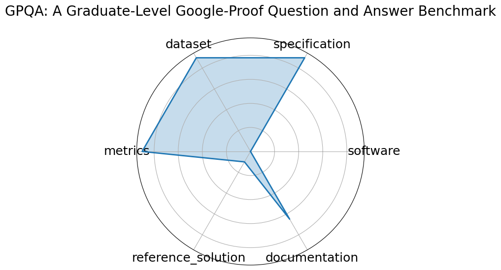

# GPQA: A Graduate-Level Google-Proof Question and Answer Benchmark

**Date**: 2023-11-20

**Name**: GPQA: A Graduate-Level Google-Proof Question and Answer Benchmark

**Domain**: Science  Biology, Physics, Chemistry 

**Focus**: Graduate-level, expert-validated multiple-choice questions hard even with web access

**Keywords**: Google-proof, multiple-choice, expert reasoning, science QA

**Task Types**: Multiple choice

**Metrics**: Accuracy

**Models**: GPT-4 baseline

**Citation**:

- David Rein, Betty Li Hou, Asa Cooper Stickland, Jackson Petty, Richard Yuanzhe Pang, Julien Dirani, Julian Michael, and Samuel R. Bowman. Gpqa: a graduate-level google-proof q and a benchmark. 2023. URL: https://arxiv.org/abs/2311.12022, arXiv:2311.12022.

  - bibtex: |

      @misc{rein2023gpqagraduatelevelgoogleproofqa,

        archiveprefix = {arXiv},

        author        = {David Rein and Betty Li Hou and Asa Cooper Stickland and Jackson Petty and Richard Yuanzhe Pang and Julien Dirani and Julian Michael and Samuel R. Bowman},

        eprint        = {2311.12022},

        primaryclass  = {cs.AI},

        title         = {GPQA: A Graduate-Level Google-Proof Q and A Benchmark},

        url           = {https://arxiv.org/abs/2311.12022},

        year          = {2023}

      }

**Ratings:**

Specification:

  - **Rating:** 9.0

  - **Reason:** Clear dual-modality task  image + time-series ; environmental focus is well described.

Dataset:

  - **Rating:** 9.0

  - **Reason:** Time-series and satellite imagery data provided; sensor info and collection intervals are explained.

Metrics:

  - **Rating:** 9.0

  - **Reason:** ROC-AUC, Precision/Recall are appropriate and robust.

Reference Solution:

  - **Rating:** 1.0

  - **Reason:** No starter model or baseline code linked

Documentation:

  - **Rating:** 6.5

  - **Reason:** Moderate Codabench documentation with climate context; lacks pipeline-level walkthrough.

**Radar Plot:**
 