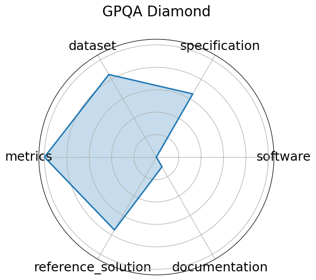

# GPQA Diamond


**Edit:** [edit this entry](https://github.com/mlcommons-science/benchmark/tree/main/source)


**Date**: 2023-11-20


**Name**: GPQA Diamond


**Domain**: Science


**Focus**: Graduate-level scientific reasoning


**Keywords**: Google-proof, graduate-level, science QA, chemistry, physics


**Task Types**: Multiple choice, Multi-step QA


**Metrics**: Accuracy


**Models**: o1, DeepSeek-R1


**Citation**:


- David Rein, Betty Li Hou, and Asa Cooper Stickland. Gpqa: a graduate-level google-proof q and a benchmark. 2023. URL: https://arxiv.org/abs/2311.12022.

  - bibtex:
      ```
      @misc{rein2023gpqagraduatelevelgoogleproofqa,

        title={GPQA: A Graduate-Level Google-Proof Q and A Benchmark},

        author={Rein, David and Hou, Betty Li and Stickland, Asa Cooper},

        year={2023},

        url={https://arxiv.org/abs/2311.12022}

      }

      ```

**Ratings:**


Software:


  - **Rating:** 5


  - **Reason:** Python version and requirements specified on Github site 


Specification:


  - **Rating:** 2


  - **Reason:** No system constraints or I/O specified 


Dataset:


  - **Rating:** 5


  - **Reason:** Easily able to access dataset. Comes with predefined splits as mentioned in the paper 


Metrics:


  - **Rating:** 5


  - **Reason:** Each question has a correct answer, representing the tested model's performance. 


Reference Solution:


  - **Rating:** 1


  - **Reason:** Common models such as GPT-3.5 were compared. They are not open and don't provide requirements 


Documentation:


  - **Rating:** 5


  - **Reason:** All information is listed in the associated paper 


**Average Rating:** 3.833


**Radar Plot:**
 