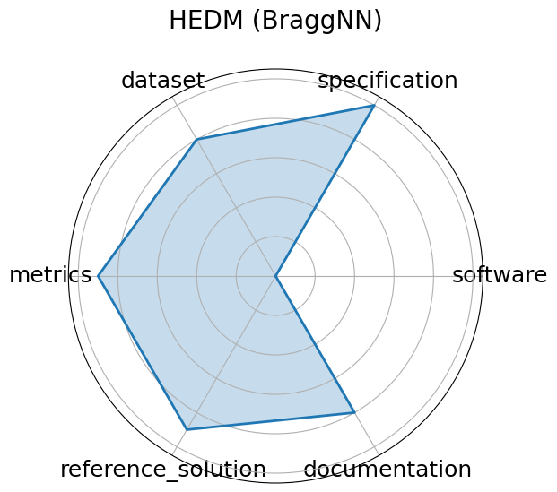

# HEDM (BraggNN)


**Date**: 2023-10-03


**Name**: HEDM  BraggNN 


**Domain**: Material Science


**Focus**: Fast Bragg peak analysis using deep learning in diffraction microscopy


**Keywords**: BraggNN, diffraction, peak finding, HEDM


**Task Types**: Peak detection


**Metrics**: Localization accuracy, Inference time


**Models**: BraggNN


**Citation**:


- Zhengchun Liu, Hemant Sharma, Jun-Sang Park, Peter Kenesei, Antonino Miceli, Jonathan Almer, Rajkumar Kettimuthu, and Ian Foster. Braggnn: fast x-ray bragg peak analysis using deep learning. 2021. URL: https://arxiv.org/abs/2008.08198, arXiv:2008.08198.

  - bibtex:
      ```
      @misc{liu2021braggnnfastxraybragg,

        archiveprefix = {arXiv},

        author        = {Zhengchun Liu and Hemant Sharma and Jun-Sang Park and Peter Kenesei and Antonino Miceli and Jonathan Almer and Rajkumar Kettimuthu and Ian Foster},

        eprint        = {2008.08198},

        primaryclass  = {eess.IV},

        title         = {BraggNN: Fast X-ray Bragg Peak Analysis Using Deep Learning},

        url           = {https://arxiv.org/abs/2008.08198},

        year          = {2021}

      }

      ```

**Ratings:**


Software:


  - **Rating:** 2


  - **Reason:** No standalone code repository or setup instructions provided 


Specification:


  - **Rating:** 5


  - **Reason:** None 


Dataset:


  - **Rating:** 2


  - **Reason:** No dataset links or FAIR metadata; unclear public access 


Metrics:


  - **Rating:** 4


  - **Reason:** Only localization accuracy and inference time mentioned; not formally benchmarked with scripts 


Reference Solution:


  - **Rating:** 3


  - **Reason:** BraggNN model is described and evaluated, but no direct implementation or inference scripts available 


Documentation:


  - **Rating:** 3


  - **Reason:** Paper is clear, but lacks a GitHub repo or full reproducibility pipeline 


**Average Rating:** 3.167


**Radar Plot:**
 