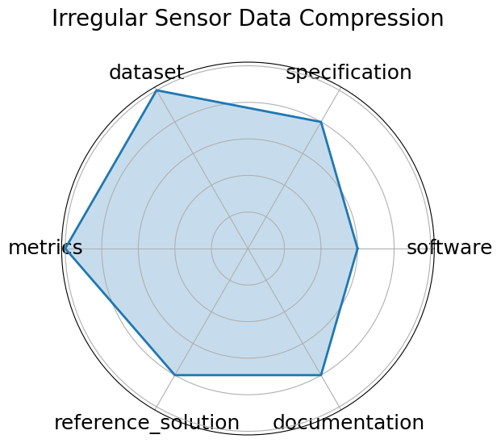

# Irregular Sensor Data Compression

**Date**: 2024-05-01

**Name**: Irregular Sensor Data Compression

**Domain**: Particle Physics

**Focus**: Real-time compression of sparse sensor data with autoencoders

**Keywords**: compression, autoencoder, sparse data, irregular sampling

**Task Types**: Compression

**Metrics**: MSE, Compression ratio

**Models**: Autoencoder, Quantized autoencoder

**Citation**:

- Javier Duarte, Nhan Tran, Ben Hawks, Christian Herwig, Jules Muhizi, Shvetank Prakash, and Vijay Janapa Reddi. Fastml science benchmarks: accelerating real-time scientific edge machine learning. 2022. URL: https://arxiv.org/abs/2207.07958, arXiv:2207.07958.

  - bibtex: |

      @misc{duarte2022fastmlsciencebenchmarksaccelerating,

        archiveprefix = {arXiv},

        author        = {Javier Duarte and Nhan Tran and Ben Hawks and Christian Herwig and Jules Muhizi and Shvetank Prakash and Reddi, Vijay Janapa},

        eprint        = {2207.07958},

        primaryclass  = {cs.LG},

        title         = {FastML Science Benchmarks: Accelerating Real-Time Scientific Edge Machine Learning},

        url           = {https://arxiv.org/abs/2207.07958},

        year          = {2022}

      }

**Ratings:**

Specification:

  - **Rating:** 8.0

  - **Reason:** Classification is clearly defined for real-time inference on simulated LHC jets. Input features  HLFs  are documented, though exact latency or resource constraints are not numerically specified. 

Dataset:

  - **Rating:** 9.0

  - **Reason:** Two datasets  OpenML and Zenodo  are public, well-formatted, and documented; FAIR principles are followed, though richer metadata would raise confidence to a 10. 

Metrics:

  - **Rating:** 9.0

  - **Reason:** AUC and Accuracy are standard, quantitative, and well-aligned with goals of jet tagging and inference efficiency. 

Reference Solution:

  - **Rating:** 8.0

  - **Reason:** Float and quantized Keras/QKeras models are provided with results. Reproducibility is good, though full automation and documentation could be improved. 

Documentation:

  - **Rating:** 8.0

  - **Reason:** GitHub contains baseline code, data loaders, and references, but setup for deployment  e.g., FPGA pipeline  requires familiarity with the tooling. 

**Radar Plot:**
 