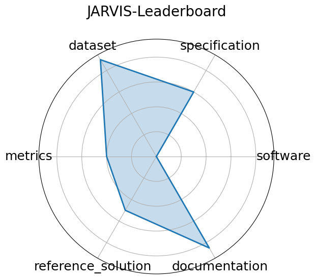

# JARVIS-Leaderboard

**Date**: 2023-06-20

**Name**: JARVIS-Leaderboard

**Domain**: Materials Science; Benchmarking

**Focus**: Comparative evaluation of materials design methods

**Keywords**: leaderboards, materials methods, simulation

**Task Types**: Method benchmarking, Leaderboard ranking

**Metrics**: MAE, RMSE, Accuracy

**Models**: unkown

**Citation**:

- Kamal Choudhary, Daniel Wines, Kangming Li, Kevin F. Garrity, Vishu Gupta, Aldo H. Romero, Jaron T. Krogel, Kayahan Saritas, Addis Fuhr, Panchapakesan Ganesh, Paul R. C. Kent, Keqiang Yan, Yuchao Lin, Shuiwang Ji, Ben Blaiszik, Patrick Reiser, Pascal Friederich, Ankit Agrawal, Pratyush Tiwary, Eric Beyerle, Peter Minch, Trevor D. Rhone, Ichiro Takeuchi, Robert B. Wexler, Arun Mannodi-Kanakkithodi, Elif Ertekin, Avanish Mishra, Nithin Mathew, Mitchell Wood, Andrew D. Rohskopf, Jason Hattrick-Simpers, Shih-Han Wang, Luke E. K. Achenie, Hongliang Xin, Maureen Williams, Adam J. Biacchi, and Francesca Tavazza. JARVIS-Leaderboard: a large scale benchmark of materials design methods. npj Computational Materials, 10(1):93, 2024. URL: https://doi.org/10.1038/s41524-024-01259-w, doi:10.1038/s41524-024-01259-w.

  - bibtex: |

      @article{choudhary2024jarvis,

        title = {{JARVIS-Leaderboard}: a large scale benchmark of materials design methods},

      author = {Choudhary, Kamal and Wines, Daniel and Li, Kangming and Garrity, Kevin F. and Gupta, Vishu and Romero, Aldo H. and Krogel, Jaron T. and Saritas, Kayahan and Fuhr, Addis and Ganesh, Panchapakesan and Kent, Paul R. C. and Yan, Keqiang and Lin, Yuchao and Ji, Shuiwang and Blaiszik, Ben and Reiser, Patrick and Friederich, Pascal and Agrawal, Ankit and Tiwary, Pratyush and Beyerle, Eric and Minch, Peter and Rhone, Trevor D. and Takeuchi, Ichiro and Wexler, Robert B. and Mannodi-Kanakkithodi, Arun and Ertekin, Elif and Mishra, Avanish and Mathew, Nithin and Wood, Mitchell and Rohskopf, Andrew D. and Hattrick-Simpers, Jason and Wang, Shih-Han and Achenie, Luke E. K. and Xin, Hongliang and Williams, Maureen and Biacchi, Adam J. and Tavazza, Francesca},

        journal = {npj Computational Materials},

        volume = {10},

        number = {1},

        pages = {93},

        year = {2024},

        doi = {10.1038/s41524-024-01259-w},

        url = {https://doi.org/10.1038/s41524-024-01259-w}

      }

**Ratings:**

Specification:

  - **Rating:** 6

  - **Reason:** Tasks are clearly defined; heterogeneity in benchmarks slightly reduces uniformity; I/O format is not specified 

Dataset:

  - **Rating:** 9

  - **Reason:** Data is versioned, public, and adheres to FAIR principles across the NIST-hosted infrastructure; however, metadata completeness varies slightly across benchmarks. 

Metrics:

  - **Rating:** 4

  - **Reason:** Overall goal is stated, but the exact metric evaluated is not listed 

Reference Solution:

  - **Rating:** 5

  - **Reason:** Many baselines across tasks  CGCNN, ALIGNN, M3GNet, etc. ; documentation is good, but baselines may be hard to find or not available for every individual task. 

Documentation:

  - **Rating:** 8.5

  - **Reason:** JARVIS-Tools and leaderboard APIs are well-documented and actively maintained; minimal setup burden, though some task-specific workflows may require additional guidance. 

**Radar Plot:**
 