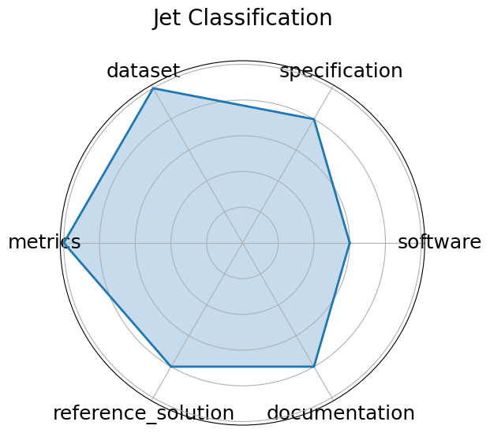

# Jet Classification

**Date**: 2024-05-01

**Name**: Jet Classification

**Domain**: Particle Physics

**Focus**: Real-time classification of particle jets using HL-LHC simulation features

**Keywords**: classification, real-time ML, jet tagging, QKeras

**Task Types**: Classification

**Metrics**: Accuracy, AUC

**Models**: Keras DNN, QKeras quantized DNN

**Citation**:

- Javier Duarte, Nhan Tran, Ben Hawks, Christian Herwig, Jules Muhizi, Shvetank Prakash, and Vijay Janapa Reddi. Fastml science benchmarks: accelerating real-time scientific edge machine learning. 2022. URL: https://arxiv.org/abs/2207.07958, arXiv:2207.07958.

  - bibtex: |

      @misc{duarte2022fastml,

        archiveprefix = {arXiv},

        author        = {Javier Duarte and Nhan Tran and Ben Hawks and Christian Herwig and Jules Muhizi and Shvetank Prakash and Vijay Janapa Reddi},

        eprint        = {2207.07958},

        primaryclass  = {cs.LG},

        title         = {FastML Science Benchmarks: Accelerating Real-Time Scientific Edge Machine Learning},

        url           = {https://arxiv.org/abs/2207.07958},

        year          = {2022}

      }

**Ratings:**

Specification:

  - **Rating:** 9.0

  - **Reason:** Task and format  multiple-choice QA with 5 options  are clearly defined; grounded in ConceptNet with consistent structure, though no hardware/system constraints are specified. 

Dataset:

  - **Rating:** 9.0

  - **Reason:** Public, versioned, and FAIR-compliant; includes metadata, splits, and licensing; well-integrated with HuggingFace and other ML libraries. 

Metrics:

  - **Rating:** 9.0

  - **Reason:** Accuracy is a simple, reproducible metric aligned with task goals; no ambiguity in evaluation. 

Reference Solution:

  - **Rating:** 8.0

  - **Reason:** Several baseline models  e.g., BERT, RoBERTa  are reported with scores; implementations exist in public repos, but not bundled as an official starter kit. 

Documentation:

  - **Rating:** 7.0

  - **Reason:** Clear paper, GitHub repo, and integration with HuggingFace Datasets; full reproducibility requires manually connecting models to dataset. 

**Radar Plot:**
 