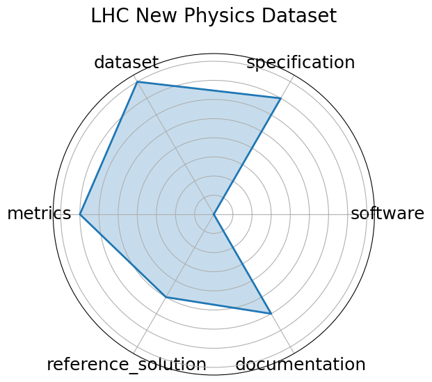

# LHC New Physics Dataset

**Date**: 2021-07-05

**Name**: LHC New Physics Dataset

**Domain**: Particle Physics; Real-time Triggering

**Focus**: Real-time LHC event filtering for anomaly detection using proton collision data

**Keywords**: anomaly detection, proton collision, real-time inference, event filtering, unsupervised ML

**Task Types**: Anomaly detection, Event classification

**Metrics**: ROC-AUC, Detection efficiency

**Models**: Autoencoder, Variational autoencoder, Isolation forest

**Citation**:

- Thea Aarrestad, Ekaterina Govorkova, Jennifer Ngadiuba, Ema Puljak, Maurizio Pierini, and Kinga Anna Wozniak. Unsupervised new physics detection at 40 mhz: training dataset. 2021. URL: https://zenodo.org/record/5046389, doi:10.5281/ZENODO.5046389.

  - bibtex: |

      @misc{https://doi.org/10.5281/zenodo.5046389,

        author    = {Aarrestad, Thea and Govorkova, Ekaterina and Ngadiuba, Jennifer and Puljak, Ema and Pierini, Maurizio and Wozniak, Kinga Anna},

        copyright = {Creative Commons Attribution 4.0 International},

        doi       = {10.5281/ZENODO.5046389},

        publisher = {Zenodo},

        title     = {Unsupervised New Physics detection at 40 MHz: Training Dataset},

        url       = {https://zenodo.org/record/5046389},

        year      = {2021}

      }

**Ratings:**

Specification:

  - **Rating:** 7.0

  - **Reason:** The problem  anomaly detection for new physics at LHC  is clearly described with goals and background, but lacks a formal task specification or constraints. 

Dataset:

  - **Rating:** 8.0

  - **Reason:** Large-scale, public dataset derived from LHC simulations; well-documented and available via Zenodo. 

Metrics:

  - **Rating:** 7.0

  - **Reason:** Provides AUROC, accuracy, and anomaly detection metrics but lacks standardized evaluation script. 

Reference Solution:

  - **Rating:** 5.0

  - **Reason:** Baseline models  autoencoders, GANs  are described in associated papers, but implementations vary across papers. 

Documentation:

  - **Rating:** 6.0

  - **Reason:** Publicly available papers and datasets with descriptions, but no unified README or training setup. 

**Radar Plot:**
 