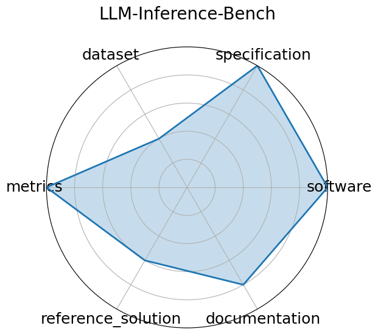

# LLM-Inference-Bench

**Date**: 2024-10-31

**Name**: LLM-Inference-Bench

**Domain**: LLM; HPC/inference

**Focus**: Hardware performance benchmarking of LLMs on AI accelerators

**Keywords**: LLM, inference benchmarking, GPU, accelerator, throughput

**Task Types**: Inference Benchmarking

**Metrics**: Token throughput  tok/s , Latency, Framework-hardware mix performance

**Models**: LLaMA-2-7B, LLaMA-2-70B, Mistral-7B, Qwen-7B

**Citation**:

- Krishna Teja Chitty-Venkata, Siddhisanket Raskar, Bharat Kale, Farah Ferdaus, Aditya Tanikanti, Ken Raffenetti, Valerie Taylor, Murali Emani, and Venkatram Vishwanath. Llm-inference-bench: inference benchmarking of large language models on ai accelerators. In SC24-W: Workshops of the International Conference for High Performance Computing, Networking, Storage and Analysis, volume, 1362 1379. 2024. doi:10.1109/SCW63240.2024.00178.

  - bibtex: |

      @INPROCEEDINGS{10820566,

        author={Chitty-Venkata, Krishna Teja and Raskar, Siddhisanket and Kale, Bharat and Ferdaus, Farah and Tanikanti, Aditya and Raffenetti, Ken and Taylor, Valerie and Emani, Murali and Vishwanath, Venkatram},

        booktitle={SC24-W: Workshops of the International Conference for High Performance Computing, Networking, Storage and Analysis}, 

        title={LLM-Inference-Bench: Inference Benchmarking of Large Language Models on AI Accelerators}, 

        year={2024},

        volume={},

        number={},

        pages={1362-1379},

        keywords={Performance evaluation;Power demand;Computational modeling;Large language models;Scalability;High performance computing;AI accelerators;Benchmark testing;Propulsion;Throughput;Large Language Models;AI Accelerators;Inference Performance Evaluation;Benchmarking},

        doi={10.1109/SCW63240.2024.00178}}

      }

**Ratings:**

Specification:

  - **Rating:** 9.0

  - **Reason:** PDE tasks  forward/inverse  and I/O structures are clearly specified with detailed PDE context and constraints. 

Dataset:

  - **Rating:** 10.0

  - **Reason:** Hosted via DaRUS with a DOI, well-documented, versioned, and FAIR-compliant. 

Metrics:

  - **Rating:** 9.0

  - **Reason:** Uses RMSE variants and Fourier-based errors. 

Reference Solution:

  - **Rating:** 10.0

  - **Reason:** Baselines  FNO, U-Net, PINN  implemented and ready-to-run; strong community adoption. 

Documentation:

  - **Rating:** 9.0

  - **Reason:** Clean GitHub with usage, dataset links, and tutorial notebooks. 

**Radar Plot:**
 