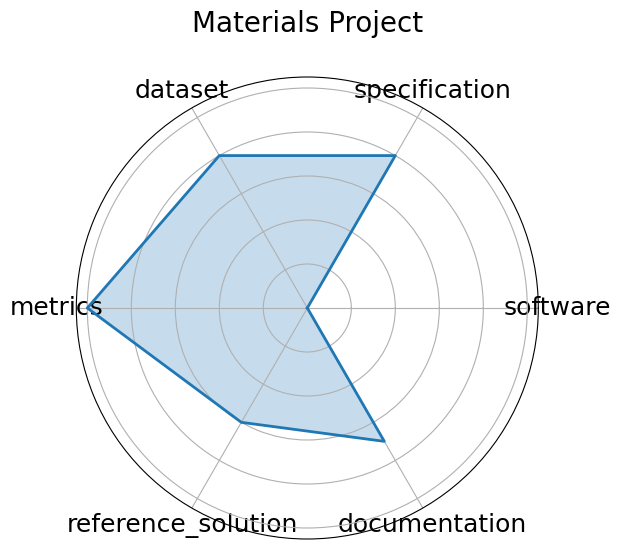

# Materials Project

**Date**: 2011-10-01

**Name**: Materials Project

**Domain**: Materials Science

**Focus**: DFT-based property prediction

**Keywords**: DFT, materials genome, high-throughput

**Task Types**: Property prediction

**Metrics**: MAE, R^2

**Models**: Automatminer, Crystal Graph Neural Networks

**Citation**:

- Anubhav Jain, Shyue Ping Ong, Geoffroy Hautier, Wei Chen, William Davidson Richards, Stephen Dacek, Shreyas Cholia, Dan Gunter, David Skinner, Gerbrand Ceder, and Kristin A. Persson. The materials project: a materials genome approach. APL Materials, 2013. URL: https://materialsproject.org/, doi:10.1063/1.4812323.

  - bibtex: |

      @article{jain2013materials,

        title={The Materials Project: A materials genome approach},

        author={Jain, Anubhav and Ong, Shyue Ping and Hautier, Geoffroy and Chen, Wei and Richards, William Davidson and Dacek, Stephen and Cholia, Shreyas and Gunter, Dan and Skinner, David and Ceder, Gerbrand and Persson, Kristin A.},

        journal={APL Materials},

        volume    = {1},

        number    = {1},

        year={2013},

        doi       = {10.1063/1.4812323},

        url={https://materialsproject.org/}

      }

**Ratings:**

Specification:

  - **Rating:** 8

  - **Reason:** The platform offers a wide range of material property prediction tasks, but task framing and I/O formats vary by API use and are not always standardized across use cases. 

Dataset:

  - **Rating:** 8

  - **Reason:** Data is versioned, accessible through both UI and API, with rich metadata and citations; widely reused. API key required to access data. 

Metrics:

  - **Rating:** 10

  - **Reason:** Uses numerical metrics like MAE and R^2 

Reference Solution:

  - **Rating:** 6

  - **Reason:** Numerous models  e.g., Automatminer, CGCNN  trained on the database, but no single canonical baseline is tightly integrated into the platform. 

Documentation:

  - **Rating:** 7

  - **Reason:** Extensive API, code repositories, and user guides exist, but end-to-end benchmarking workflows require additional setup by users. 'Documentation' link did not work. 

**Radar Plot:**
 