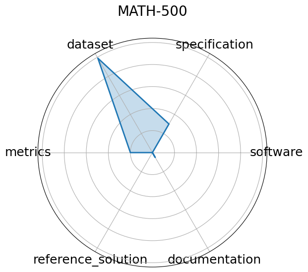

# MATH-500

**Date**: 2025-02-15

**Name**: MATH-500

**Domain**: Mathematics

**Focus**: Math reasoning generalization

**Keywords**: calculus, algebra, number theory, geometry

**Task Types**: Problem solving

**Metrics**: Accuracy

**Models**: unkown

**Citation**:

- HuggingFaceH4. Math-500. 2025. URL: https://huggingface.co/datasets/HuggingFaceH4/MATH-500.

  - bibtex: |

      @misc{huggingface2025math500,

        title={MATH-500},

        author={HuggingFaceH4},

        year={2025},

        url={https://huggingface.co/datasets/HuggingFaceH4/MATH-500}

      }

**Ratings:**

Specification:

  - **Rating:** 3

  - **Reason:** Known what the problems are, but method of presentation and evaluation is not stated. No HW constraints 

Dataset:

  - **Rating:** 9.9

  - **Reason:** Problems and solutions are easily downloaded. Could not find a way to download the data 

Metrics:

  - **Rating:** 2

  - **Reason:** Problem spec states that all of the AI reasoning steps are subject to grading, but no specified way to evaluate the steps 

Reference Solution:

  - **Rating:** 0

  - **Reason:** Not given 

Documentation:

  - **Rating:** 0.5

  - **Reason:** Not given. Implicit instructions to download dataset. 

**Radar Plot:**
 