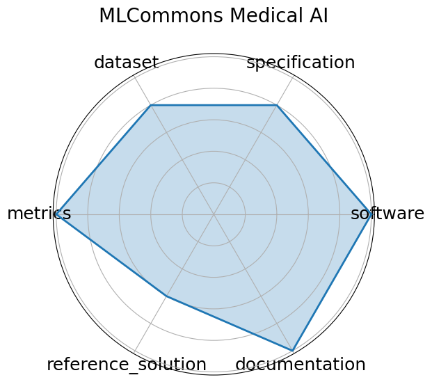

# MLCommons Medical AI


**Edit:** [edit this entry](https://github.com/mlcommons-science/benchmark/tree/main/source)


**Date**: 2023-07-17


**Name**: MLCommons Medical AI


**Domain**: Healthcare; Medical AI


**Focus**: Federated benchmarking and evaluation of medical AI models across diverse real-world clinical data


**Keywords**: medical AI, federated evaluation, privacy-preserving, fairness, healthcare benchmarks


**Task Types**: Federated evaluation, Model validation


**Metrics**: ROC AUC, Accuracy, Fairness metrics


**Models**: MedPerf-validated CNNs, GaNDLF workflows


**Citation**:


- Alexandros Karargyris, Renato Umeton, Micah J. Sheller, Alejandro Aristizabal, Johnu George, Anna Wuest, Sarthak Pati, Hasan Kassem, Maximilian Zenk, Ujjwal Baid, Prakash Narayana Moorthy, Alexander Chowdhury, Junyi Guo, Sahil Nalawade, Jacob Rosenthal, David Kanter, Maria Xenochristou, Daniel J. Beutel, Verena Chung, Timothy Bergquist, James Eddy, Abubakar Abid, Lewis Tunstall, Omar Sanseviero, Dimitrios Dimitriadis, Yiming Qian, Xinxing Xu, Yong Liu, Rick Siow Mong Goh, Srini Bala, Victor Bittorf, Sreekar Reddy Puchala, Biagio Ricciuti, Soujanya Samineni, Eshna Sengupta, Akshay Chaudhari, Cody Coleman, Bala Desinghu, Gregory Diamos, Debo Dutta, Diane Feddema, Grigori Fursin, Xinyuan Huang, Satyananda Kashyap, Nicholas Lane, Indranil Mallick, Pietro Mascagni, Virendra Mehta, Cassiano Ferro Moraes, Vivek Natarajan, Nikola Nikolov, Nicolas Padoy, Gennady Pekhimenko, Vijay Janapa Reddi, G. Anthony Reina, Pablo Ribalta, Abhishek Singh, Jayaraman J. Thiagarajan, Jacob Albrecht, Thomas Wolf, Geralyn Miller, Huazhu Fu, Prashant Shah, Daguang Xu, Poonam Yadav, David Talby, Mark M. Awad, Jeremy P. Howard, Michael Rosenthal, Luigi Marchionni, Massimo Loda, Jason M. Johnson, Spyridon Bakas, Peter Mattson, FeTS Consortium, BraTS-2020 Consortium, and AI4SafeChole Consortium. Federated benchmarking of medical artificial intelligence with medperf. Nature Machine Intelligence, 5(7):799–810, July 2023. URL: https://doi.org/10.1038/s42256-023-00652-2, doi:10.1038/s42256-023-00652-2.

  - bibtex:
      ```
      @article{karargyris2023federated,

        author = {Karargyris, Alexandros and Umeton, Renato and Sheller, Micah J. and Aristizabal, Alejandro and George, Johnu and Wuest, Anna and Pati, Sarthak and Kassem, Hasan and Zenk, Maximilian and Baid, Ujjwal and Narayana Moorthy, Prakash and Chowdhury, Alexander and Guo, Junyi and Nalawade, Sahil and Rosenthal, Jacob and Kanter, David and Xenochristou, Maria and Beutel, Daniel J. and Chung, Verena and Bergquist, Timothy and Eddy, James and Abid, Abubakar and Tunstall, Lewis and Sanseviero, Omar and Dimitriadis, Dimitrios and Qian, Yiming and Xu, Xinxing and Liu, Yong and Goh, Rick Siow Mong and Bala, Srini and Bittorf, Victor and Puchala, Sreekar Reddy and Ricciuti, Biagio and Samineni, Soujanya and Sengupta, Eshna and Chaudhari, Akshay and Coleman, Cody and Desinghu, Bala and Diamos, Gregory and Dutta, Debo and Feddema, Diane and Fursin, Grigori and Huang, Xinyuan and Kashyap, Satyananda and Lane, Nicholas and Mallick, Indranil and Mascagni, Pietro and Mehta, Virendra and Moraes, Cassiano Ferro and Natarajan, Vivek and Nikolov, Nikola and Padoy, Nicolas and Pekhimenko, Gennady and Reddi, Vijay Janapa and Reina, G. Anthony and Ribalta, Pablo and Singh, Abhishek and Thiagarajan, Jayaraman J. and Albrecht, Jacob and Wolf, Thomas and Miller, Geralyn and Fu, Huazhu and Shah, Prashant and Xu, Daguang and Yadav, Poonam and Talby, David and Awad, Mark M. and Howard, Jeremy P. and Rosenthal, Michael and Marchionni, Luigi and Loda, Massimo and Johnson, Jason M. and Bakas, Spyridon and Mattson, Peter and FeTS Consortium and BraTS-2020 Consortium and AI4SafeChole Consortium},

        month = jul,

        doi = {10.1038/s42256-023-00652-2},

        journal = {Nature Machine Intelligence},

        number = {7},

        pages = {799--810},

        title = {Federated benchmarking of medical artificial intelligence with MedPerf},

        url = {https://doi.org/10.1038/s42256-023-00652-2},

        volume = {5},

        year = {2023},

      }

      ```

**Ratings:**


Software:


  - **Rating:** 5


  - **Reason:** GitHub repository  https://github.com/mlcommons/medical  provides actively maintained open-source tools like MedPerf and GaNDLF for federated medical AI evaluation. 


Specification:


  - **Rating:** 4


  - **Reason:** The platform defines federated tasks and model evaluation scenarios. Some clinical and system-level constraints are implied but not uniformly formalized across all use cases. 


Dataset:


  - **Rating:** 4


  - **Reason:** Multi-institutional datasets used in federated settings; real-world data is handled privately onsite, but some FAIR aspects  e.g., accessibility and metadata  are implicit. 


Metrics:


  - **Rating:** 5


  - **Reason:** Metrics such as ROC AUC, accuracy, and fairness are clearly specified and directly support goals like generalizability and equity. 


Reference Solution:


  - **Rating:** 3


  - **Reason:** GaNDLF workflows and MedPerf-validated CNNs are referenced, but not all baseline models are centrally documented or easily reproducible. 


Documentation:


  - **Rating:** 5


  - **Reason:** Extensive documentation, papers, and community support exist. Clear examples and usage instructions are provided in GitHub and publications. 


**Average Rating:** 4.333


**Radar Plot:**
 