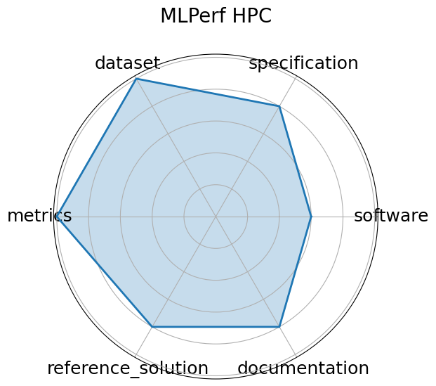

# MLPerf HPC


**Date**: 2021-10-20


**Name**: MLPerf HPC


**Domain**: Cosmology, Climate, Protein Structure, Catalysis


**Focus**: Scientific ML training and inference on HPC systems


**Keywords**: HPC, training, inference, scientific ML


**Task Types**: Training, Inference


**Metrics**: Training time, Accuracy, GPU utilization


**Models**: CosmoFlow, DeepCAM, OpenCatalyst


**Citation**:


- Steven Farrell, Murali Emani, Jacob Balma, Lukas Drescher, Aleksandr Drozd, Andreas Fink, Geoffrey Fox, David Kanter, Thorsten Kurth, Peter Mattson, Dawei Mu, Amit Ruhela, Kento Sato, Koichi Shirahata, Tsuguchika Tabaru, Aristeidis Tsaris, Jan Balewski, Ben Cumming, Takumi Danjo, Jens Domke, Takaaki Fukai, Naoto Fukumoto, Tatsuya Fukushi, Balazs Gerofi, Takumi Honda, Toshiyuki Imamura, Akihiko Kasagi, Kentaro Kawakami, Shuhei Kudo, Akiyoshi Kuroda, Maxime Martinasso, Satoshi Matsuoka, Henrique Mendonça, Kazuki Minami, Prabhat Ram, Takashi Sawada, Mallikarjun Shankar, Tom St. John, Akihiro Tabuchi, Venkatram Vishwanath, Mohamed Wahib, Masafumi Yamazaki, and Junqi Yin. Mlperf hpc: a holistic benchmark suite for scientific machine learning on hpc systems. 2021. URL: https://arxiv.org/abs/2110.11466, arXiv:2110.11466.

  - bibtex:
      ```
      @misc{farrell2021mlperfhpcholisticbenchmark,

        archiveprefix = {arXiv},

        author        = {Steven Farrell and Murali Emani and Jacob Balma and Lukas Drescher and Aleksandr Drozd and Andreas Fink and Geoffrey Fox and David Kanter and Thorsten Kurth and Peter Mattson and Dawei Mu and Amit Ruhela and Kento Sato and Koichi Shirahata and Tsuguchika Tabaru and Aristeidis Tsaris and Jan Balewski and Ben Cumming and Takumi Danjo and Jens Domke and Takaaki Fukai and Naoto Fukumoto and Tatsuya Fukushi and Balazs Gerofi and Takumi Honda and Toshiyuki Imamura and Akihiko Kasagi and Kentaro Kawakami and Shuhei Kudo and Akiyoshi Kuroda and Maxime Martinasso and Satoshi Matsuoka and Henrique Mendonça and Kazuki Minami and Prabhat Ram and Takashi Sawada and Mallikarjun Shankar and Tom St. John and Akihiro Tabuchi and Venkatram Vishwanath and Mohamed Wahib and Masafumi Yamazaki and Junqi Yin},

        eprint        = {2110.11466},

        primaryclass  = {cs.LG},

        title         = {MLPerf HPC: A Holistic Benchmark Suite for Scientific Machine Learning on HPC Systems},

        url           = {https://arxiv.org/abs/2110.11466},

        year          = {2021}

      }

      ```

**Ratings:**


Software:


  - **Rating:** 3


  - **Reason:** Reference implementations exist but containerization and environment setup require manual effort across HPC systems. 


Specification:


  - **Rating:** 4


  - **Reason:** Hardware constraints and I/O formats are not fully defined for all scenarios. 


Dataset:


  - **Rating:** 5


  - **Reason:** Not all data is independently versioned or comes with standardized FAIR metadata. 


Metrics:


  - **Rating:** 5


  - **Reason:** None 


Reference Solution:


  - **Rating:** 4


  - **Reason:** Reproducibility and environment tuning depend on system configuration; baseline models not uniformly bundled. 


Documentation:


  - **Rating:** 4


  - **Reason:** Central guidance is available but requires domain-specific effort to replicate results across systems. 


**Average Rating:** 4.167


**Radar Plot:**
 