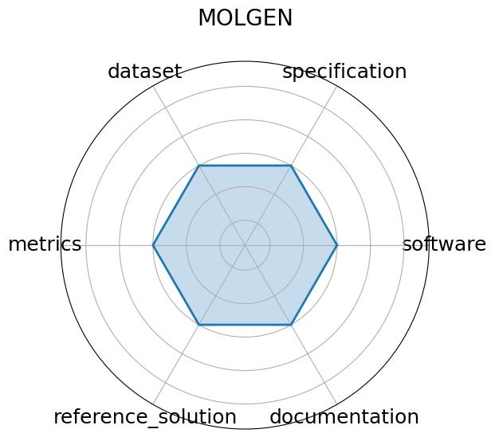

# MOLGEN


**Date**: 2023-01-26


**Name**: MOLGEN


**Domain**: Computational Chemistry


**Focus**: Molecular generation and optimization


**Keywords**: SELFIES, GAN, property optimization


**Task Types**: Distribution learning, Goal-oriented generation


**Metrics**: Validity%, Novelty%, QED, Docking score


**Models**: MolGen


**Citation**:


- Yin Fang, Ningyu Zhang, Zhuo Chen, Lingbing Guo, Xiaohui Fan, and Huajun Chen. Domain-agnostic molecular generation with chemical feedback. 2024. URL: https://arxiv.org/abs/2301.11259, arXiv:2301.11259.

  - bibtex:
      ```
      @misc{fang2024domainagnosticmoleculargenerationchemical,

        archiveprefix = {arXiv},

        author        = {Yin Fang and Ningyu Zhang and Zhuo Chen and Lingbing Guo and Xiaohui Fan and Huajun Chen},

        eprint        = {2301.11259},

        primaryclass  = {cs.LG},

        title         = {Domain-Agnostic Molecular Generation with Chemical Feedback},

        url           = {https://arxiv.org/abs/2301.11259},

        year          = {2024}

      }

      ```

**Ratings:**


Software:


  - **Rating:** 0


  - **Reason:** This is a pre-trained model 


Specification:


  - **Rating:** 0


  - **Reason:** This is a pre-trained model 


Dataset:


  - **Rating:** 0


  - **Reason:** This is a pre-trained model 


Metrics:


  - **Rating:** 0


  - **Reason:** This is a pre-trained model 


Reference Solution:


  - **Rating:** 0


  - **Reason:** This is a pre-trained model 


Documentation:


  - **Rating:** 0


  - **Reason:** This is a pre-trained model 


**Average Rating:** 0.0


**Radar Plot:**
 