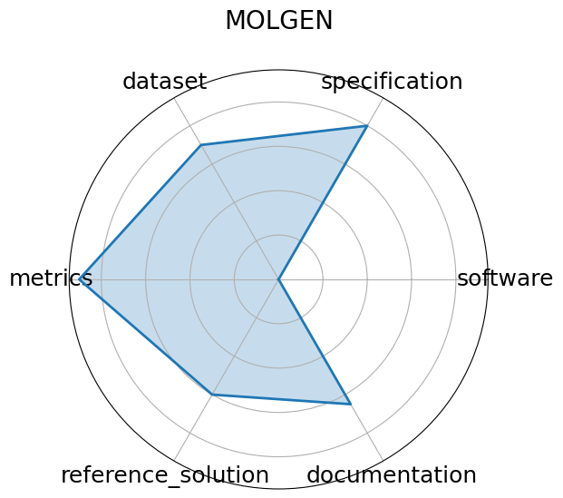

# MOLGEN

**Date**: 2023-01-26

**Name**: MOLGEN

**Domain**: Computational Chemistry

**Focus**: Molecular generation and optimization

**Keywords**: SELFIES, GAN, property optimization

**Task Types**: Distribution learning, Goal-oriented generation

**Metrics**: Validity%, Novelty%, QED, Docking score

**Models**: MolGen

**Citation**:

- Yin Fang, Ningyu Zhang, Zhuo Chen, Lingbing Guo, Xiaohui Fan, and Huajun Chen. Domain-agnostic molecular generation with chemical feedback. 2024. URL: https://arxiv.org/abs/2301.11259, arXiv:2301.11259.

  - bibtex: |

      @misc{fang2024domainagnosticmoleculargenerationchemical,

        archiveprefix = {arXiv},

        author        = {Yin Fang and Ningyu Zhang and Zhuo Chen and Lingbing Guo and Xiaohui Fan and Huajun Chen},

        eprint        = {2301.11259},

        primaryclass  = {cs.LG},

        title         = {Domain-Agnostic Molecular Generation with Chemical Feedback},

        url           = {https://arxiv.org/abs/2301.11259},

        year          = {2024}

      }

**Ratings:**

Specification:

  - **Rating:** 8

  - **Reason:** The molecular generation task is well-defined, with input/output via SELFIES and chemical properties 

Dataset:

  - **Rating:** 7

  - **Reason:** Uses standard datasets  ZINC, MOSES, QM9 ; accessible and widely used, but FAIR metadata, versioning, and splits are not detailed within this specific repo. 

Metrics:

  - **Rating:** 9

  - **Reason:** Metrics like Validity%, Novelty%, QED, and Docking Score are quantitative, supporting clear model evaluation. 

Reference Solution:

  - **Rating:** 6

  - **Reason:** Model is released and functional; some training/evaluation code exists, but it's not framed as a reusable baseline in a benchmark context. 

Documentation:

  - **Rating:** 6.5

  - **Reason:** Code is available and usable; instructions exist, though setup may require domain knowledge or adaptation for different datasets/environments. 

**Radar Plot:**
 