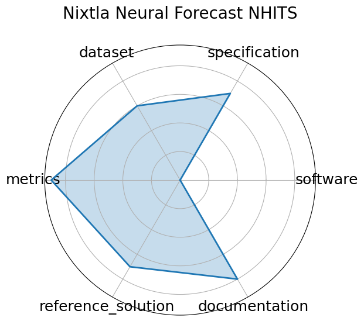

# Nixtla Neural Forecast NHITS


**Edit:** [edit this entry](https://github.com/mlcommons-science/benchmark/tree/main/source)


**Date**: 2023-06-01


**Name**: Nixtla Neural Forecast NHITS


**Domain**: Time-series; General ML


**Focus**: Official NHITS implementation for long-horizon time series forecasting


**Keywords**: NHITS, long-horizon forecasting, neural interpolation, time-series


**Task Types**: Time-series forecasting


**Metrics**: RMSE, MAPE


**Models**: NHITS


**Citation**:


- Cristian Challu, Kin G Olivares, Boris N Oreshkin, Federico Garza Ramirez, Max Mergenthaler Canseco, and Artur Dubrawski. Nhits: neural hierarchical interpolation for time series forecasting. In Proceedings of the AAAI conference on artificial intelligence, volume 37, 6989–6997. 2023.

  - bibtex:
      ```
      @inproceedings{challu2023nhits,

       title={Nhits: Neural hierarchical interpolation for time series forecasting},

       author={Challu, Cristian and Olivares, Kin G and Oreshkin, Boris N and Ramirez, Federico Garza and Canseco, Max Mergenthaler and Dubrawski, Artur},

       booktitle={Proceedings of the AAAI conference on artificial intelligence},

       volume={37},

       number={6},

       pages={6989--6997},

       year={2023}

       }

      ```

**Ratings:**


Software:


  - **Rating:** 5


  - **Reason:** Implemented within the open-source NeuralForecast library under Apache 2.0. Includes training, evaluation, and hyperparameter tuning pipelines. Actively maintained. 


Specification:


  - **Rating:** 5


  - **Reason:** The NHITS forecasting task is clearly defined with structured input/output formats. Model design targets long-horizon accuracy and compute efficiency. 


Dataset:


  - **Rating:** 3


  - **Reason:** Uses standard benchmark datasets like M4, but does not bundle them directly. FAIR compliance depends on external dataset sources and user setup. 


Metrics:


  - **Rating:** 5


  - **Reason:** Evaluated using RMSE, MAPE, and other standard forecasting metrics, integrated into training and evaluation APIs. 


Reference Solution:


  - **Rating:** 4


  - **Reason:** Official NHITS implementation is fully reproducible with training/eval configs, though pretrained weights are not always provided. 


Documentation:


  - **Rating:** 4


  - **Reason:** Well-documented on GitHub and in AAAI paper, with code examples, training guidance, and usage tutorials. More model-specific docs could improve clarity further. 


**Average Rating:** 4.333


**Radar Plot:**
 