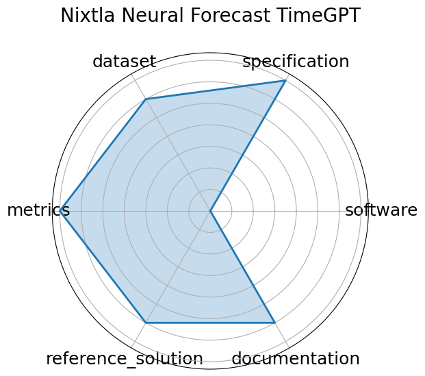

# Nixtla Neural Forecast TimeGPT


**Date**: 2023-10-05


**Name**: Nixtla Neural Forecast TimeGPT


**Domain**: Time-series; General ML


**Focus**: Time-series foundation model "TimeGPT" for forecasting and anomaly detection


**Keywords**: TimeGPT, foundation model, time-series, generative model


**Task Types**: Time-series forecasting, Anomaly detection


**Metrics**: RMSE, Anomaly detection metrics


**Models**: TimeGPT


**Citation**:


- Azul Garza, Cristian Challu, and Max Mergenthaler-Canseco. Timegpt-1. 2024. URL: https://arxiv.org/abs/2310.03589, arXiv:2310.03589.

  - bibtex:
      ```
      @misc{garza2024timegpt1,

        archiveprefix = {arXiv},

        author        = {Azul Garza and Cristian Challu and Max Mergenthaler-Canseco},

        eprint        = {2310.03589},

        primaryclass  = {cs.LG},

        title         = {TimeGPT-1},

        url           = {https://arxiv.org/abs/2310.03589},

        year          = {2024}

      }

      ```

**Ratings:**


Software:


  - **Rating:** 4


  - **Reason:** Fully open-source Apache 2.0 implementation integrated in NeuralForecast, supporting training and evaluation via API. Production-grade deployment available via Nixtla API and Azure. 


Specification:


  - **Rating:** 3


  - **Reason:** Concept and forecasting goals are described, but formal input/output definitions and task constraints are not rigorously specified. 


Dataset:


  - **Rating:** 3


  - **Reason:** Evaluated on existing open datasets, but consolidated data release, splits, and FAIR metadata are not provided. 


Metrics:


  - **Rating:** 4


  - **Reason:** Uses standard forecasting metrics such as RMSE, MASE, SMAPE, and anomaly detection metrics consistently across evaluations. 


Reference Solution:


  - **Rating:** 3


  - **Reason:** TimeGPT implementation is available, but baseline comparisons and additional reference models are limited. 


Documentation:


  - **Rating:** 3


  - **Reason:** Basic README with installation and usage examples; more detailed API docs and tutorials would improve usability. 


**Average Rating:** 3.333


**Radar Plot:**
 