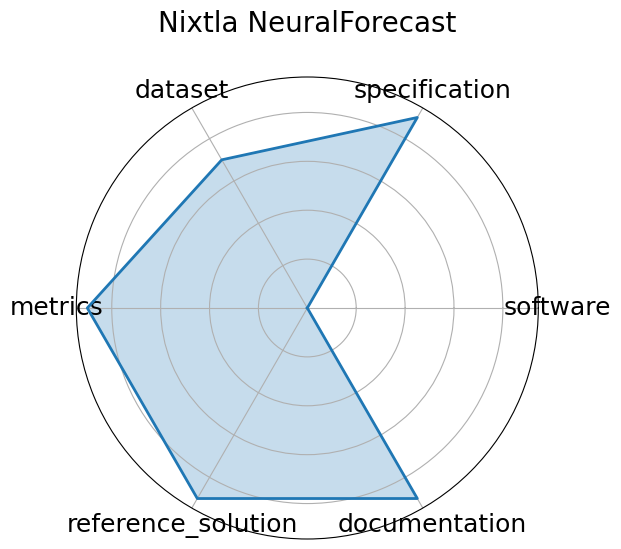

# Nixtla NeuralForecast

**Date**: 2022-04-01

**Name**: Nixtla NeuralForecast

**Domain**: Time-series forecasting; General ML

**Focus**: High-performance neural forecasting library with >30 models

**Keywords**: time-series, neural forecasting, NBEATS, NHITS, TFT, probabilistic forecasting, usability

**Task Types**: Time-series forecasting

**Metrics**: RMSE, MAPE, CRPS

**Models**: NBEATS, NHITS, TFT, DeepAR

**Citation**:

- Kin G. Olivares, Cristian Challú, Federico Garza, Max Mergenthaler Canseco, and Artur Dubrawski. Neuralforecast: user friendly state-of-the-art neural forecasting models. PyCon Salt Lake City, Utah, US 2022, 2022. URL: https://github.com/Nixtla/neuralforecast.

  - bibtex: |

      @misc{olivares2022library_neuralforecast,

        author={Kin G. Olivares and Cristian Challú and Federico Garza and Max Mergenthaler Canseco and Artur Dubrawski},

        title = {NeuralForecast: User friendly state-of-the-art neural forecasting models.},

        year={2022},

        howpublished={PyCon Salt Lake City, Utah, US 2022},

        url={https://github.com/Nixtla/neuralforecast}

      }

**Ratings:**

Specification:

  - **Rating:** 9.0

  - **Reason:** Targets high-throughput LLM inference via PagedAttention and memory-optimized serving; benchmarks cover many configs.

Dataset:

  - **Rating:** 7.0

  - **Reason:** Focuses on model configs and streaming input/output pipelines rather than classical datasets.

Metrics:

  - **Rating:** 9.0

  - **Reason:** Strong token/sec, memory usage, and TTFT metrics; comparative plots and logs included.

Reference Solution:

  - **Rating:** 9.0

  - **Reason:** Benchmarks reproducible via script with support for multiple models and hardware types.

Documentation:

  - **Rating:** 9.0

  - **Reason:** Excellent GitHub docs, CLI/API usage, and deployment walkthroughs.

**Radar Plot:**
 