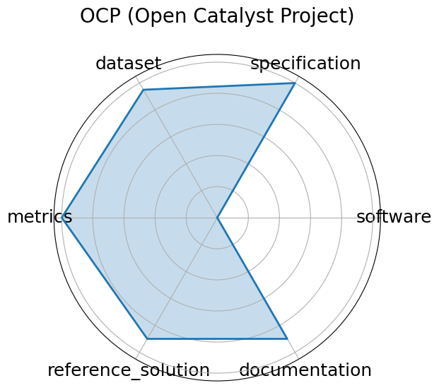

# OCP (Open Catalyst Project)


**Edit:** [edit this entry](https://github.com/mlcommons-science/benchmark/tree/main/source)


**Date**: 2020-10-20


**Name**: OCP  Open Catalyst Project 


**Domain**: Chemistry; Materials Science


**Focus**: Catalyst adsorption energy prediction


**Keywords**: DFT relaxations, adsorption energy, graph neural networks


**Task Types**: Energy prediction, Force prediction


**Metrics**: MAE  energy , MAE  force 


**Models**: CGCNN, SchNet, DimeNet++, GemNet-OC


**Citation**:


- Lowik Chanussot, Abhishek Das, Siddharth Goyal, Thibaut Lavril, Muhammed Shuaibi, Morgane Riviere, Kevin Tran, Javier Heras-Domingo, Caleb Ho, Weihua Hu, Aini Palizhati, Anuroop Sriram, Brandon Wood, Junwoong Yoon, Devi Parikh, C. Lawrence Zitnick, and Zachary Ulissi. The open catalyst 2020 (oc20) dataset and community challenges. ACS Catalysis, 11(10):6059–6072, 2021. URL: https://pubs.acs.org/doi/10.1021/acscatal.0c04525, doi:10.1021/acscatal.0c04525.

  - bibtex:
      ```
      @article{chanussot2021oc20,

        title     = {The Open Catalyst 2020 (OC20) Dataset and Community Challenges},

        author    = {Chanussot, Lowik and Das, Abhishek and Goyal, Siddharth and Lavril, Thibaut and Shuaibi, Muhammed and Riviere, Morgane and Tran, Kevin and Heras-Domingo, Javier and Ho, Caleb and Hu, Weihua and Palizhati, Aini and Sriram, Anuroop and Wood, Brandon and Yoon, Junwoong and Parikh, Devi and Zitnick, C. Lawrence and Ulissi, Zachary},

        journal   = {ACS Catalysis},

        volume    = {11},

        number    = {10},

        pages     = {6059--6072},

        year      = {2021},

        doi       = {10.1021/acscatal.0c04525},

        url       = {https://pubs.acs.org/doi/10.1021/acscatal.0c04525}

      }

- Richard Tran, Janice Lan, Muhammed Shuaibi, Brandon M. Wood, Siddharth Goyal, Abhishek Das, Javier Heras-Domingo, Adeesh Kolluru, Ammar Rizvi, Nima Shoghi, Anuroop Sriram, Félix Therrien, Jehad Abed, Oleksandr Voznyy, Edward H. Sargent, Zachary Ulissi, and C. Lawrence Zitnick. The open catalyst 2022 (oc22) dataset and challenges for oxide electrocatalysts. ACS Catalysis, 13(5):3066–3084, 2023. URL: https://pubs.acs.org/doi/10.1021/acscatal.2c05426, doi:10.1021/acscatal.2c05426.

  - bibtex:
      ```
      @article{tran2023oc22,

        title     = {The Open Catalyst 2022 (OC22) Dataset and Challenges for Oxide Electrocatalysts},

        author    = {Tran, Richard and Lan, Janice and Shuaibi, Muhammed and Wood, Brandon M. and Goyal, Siddharth and Das, Abhishek and Heras-Domingo, Javier and Kolluru, Adeesh and Rizvi, Ammar and Shoghi, Nima and Sriram, Anuroop and Therrien, Félix and Abed, Jehad and Voznyy, Oleksandr and Sargent, Edward H. and Ulissi, Zachary and Zitnick, C. Lawrence},

        journal   = {ACS Catalysis},

        volume    = {13},

        number    = {5},

        pages     = {3066--3084},

        year      = {2023},

        doi       = {10.1021/acscatal.2c05426},

        url       = {https://pubs.acs.org/doi/10.1021/acscatal.2c05426}

      }

- Lowik Chanussot, Abhishek Das, Siddharth Goyal, Thibaut Lavril, Muhammed Shuaibi, Morgane Riviere, Kevin Tran, Javier Heras-Domingo, Caleb Ho, Weihua Hu, Aini Palizhati, Anuroop Sriram, Brandon Wood, Junwoong Yoon, Devi Parikh, C. Lawrence Zitnick, and Zachary Ulissi. Open catalyst 2020 (oc20) dataset and community challenges. ACS Catalysis, 11(10):6059 6072, 2021. URL: https://doi.org/10.1021/acscatal.0c04525, arXiv:https://doi.org/10.1021/acscatal.0c04525, doi:10.1021/acscatal.0c04525.

  - bibtex:
      ```
      @article{doi:10.1021/acscatal.0c04525,

        author = {Chanussot, Lowik and Das, Abhishek and Goyal, Siddharth and Lavril, Thibaut and Shuaibi, Muhammed and Riviere, Morgane and Tran, Kevin and Heras-Domingo, Javier and Ho, Caleb and Hu, Weihua and Palizhati, Aini and Sriram, Anuroop and Wood, Brandon and Yoon, Junwoong and Parikh, Devi and Zitnick, C. Lawrence and Ulissi, Zachary},

      title = {Open Catalyst 2020 (OC20) Dataset and Community Challenges},

        journal = {ACS Catalysis},

        volume = {11},

        number = {10},

        pages = {6059-6072},

        year = {2021},

        doi = {10.1021/acscatal.0c04525},

        URL = {https://doi.org/10.1021/acscatal.0c04525},eprint = {https://doi.org/10.1021/acscatal.0c04525}}"

- Richard Tran, Janice Lan, Muhammed Shuaibi, Brandon M. Wood, Siddharth Goyal, Abhishek Das, Javier Heras-Domingo, Adeesh Kolluru, Ammar Rizvi, Nima Shoghi, Anuroop Sriram, Félix Therrien, Jehad Abed, Oleksandr Voznyy, Edward H. Sargent, Zachary Ulissi, and C. Lawrence Zitnick. The open catalyst 2022 (oc22) dataset and challenges for oxide electrocatalysts. ACS Catalysis, 13(5):3066 3084, February 2023. URL: http://dx.doi.org/10.1021/acscatal.2c05426, doi:10.1021/acscatal.2c05426.

  - bibtex:
      ```
      @article{tran2023b,

        title={The Open Catalyst 2022 (OC22) Dataset and Challenges for Oxide Electrocatalysts},

        volume={13},

        ISSN={2155-5435},

        url={http://dx.doi.org/10.1021/acscatal.2c05426},

        DOI={10.1021/acscatal.2c05426},

        number={5},

        journal={ACS Catalysis},

        publisher={American Chemical Society (ACS)},

        author={Tran, Richard and Lan, Janice and Shuaibi, Muhammed and Wood, Brandon M. and Goyal, Siddharth and Das, Abhishek and Heras-Domingo, Javier and Kolluru, Adeesh and Rizvi, Ammar and Shoghi, Nima and Sriram, Anuroop and Therrien, Félix and Abed, Jehad and Voznyy, Oleksandr and Sargent, Edward H. and Ulissi, Zachary and Zitnick, C. Lawrence},

        year={2023},

        month=feb, pages={3066-3084} 

      }

      ```

**Ratings:**


Software:


  - **Rating:** 5


  - **Reason:** Data provided in Github links 


Specification:


  - **Rating:** 5


  - **Reason:** Tasks  energy and force prediction  are clearly defined with explicit I/O specifications, constraints, and physical relevance for renewable energy. 


Dataset:


  - **Rating:** 5


  - **Reason:** Fully FAIR- OC20, per-adsorbate trajectories, and OC22 are versioned; datasets come with standardized splits, metadata, and are downloadable. 


Metrics:


  - **Rating:** 5


  - **Reason:** MAE  energy and force  are standard and reproducible. 


Reference Solution:


  - **Rating:** 4


  - **Reason:** Multiple baselines  GemNet-OC, DimeNet++, etc.  implemented and evaluated. No hardware listed. 


Documentation:


  - **Rating:** 1


  - **Reason:** Paper exists, but content is behind a paywall. 


**Average Rating:** 4.167


**Radar Plot:**
 