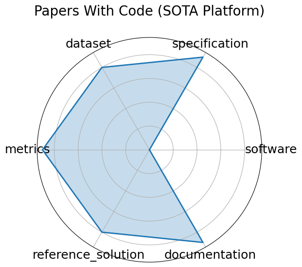

# Papers With Code (SOTA Platform)

**Date**: ongoing

**Name**: Papers With Code  SOTA Platform 

**Domain**: General ML; All domains

**Focus**: Open platform tracking state-of-the-art results, benchmarks, and implementations across ML tasks and papers

**Keywords**: leaderboard, benchmarking, reproducibility, open-source

**Task Types**: Multiple  Classification, Detection, NLP, etc. 

**Metrics**: Task-specific  Accuracy, F1, BLEU, etc. 

**Models**: All published models with code

**Citation**:

- Avrim Blum and Moritz Hardt. The ladder: a reliable leaderboard for machine learning competitions. In Francis Bach and David Blei, editors, Proceedings of the 32nd International Conference on Machine Learning, volume 37 of Proceedings of Machine Learning Research, 1006–1014. Lille, France, July 2015. PMLR. URL: https://proceedings.mlr.press/v37/blum15.html.

  - bibtex: |

      @InProceedings{pmlr-v37-blum15,

        title =    {The Ladder: A Reliable Leaderboard for Machine Learning Competitions},

        author =   {Blum, Avrim and Hardt, Moritz},

        booktitle =        {Proceedings of the 32nd International Conference on Machine Learning},

        pages =    {1006--1014},

        year =     {2015},

        editor =   {Bach, Francis and Blei, David},

        volume =   {37},

        series =   {Proceedings of Machine Learning Research},

        address =          {Lille, France},

        month =    jul,

        publisher =    {PMLR},

        pdf =      {http://proceedings.mlr.press/v37/blum15.pdf},

        url =      {https://proceedings.mlr.press/v37/blum15.html},

        abstract =         {The organizer of a machine learning competition faces the problem of maintaining an accurate leaderboard that faithfully represents the quality of the best submission of each competing team. What makes this estimation problem particularly challenging is its sequential and adaptive nature. As participants are allowed to repeatedly evaluate their submissions on the leaderboard, they may begin to overfit to the holdout data that supports the leaderboard. Few theoretical results give actionable advice on how to design a reliable leaderboard. Existing approaches therefore often resort to poorly understood heuristics such as limiting the bit precision of answers and the rate of re-submission. In this work, we introduce a notion of leaderboard accuracy tailored to the format of a competition. We introduce a natural algorithm called the Ladder and demonstrate that it simultaneously supports strong theoretical guarantees in a fully adaptive model of estimation, withstands practical adversarial attacks, and achieves high utility on real submission files from a Kaggle competition. Notably, we are able to sidestep a powerful recent hardness result for adaptive risk estimation that rules out algorithms such as ours under a seemingly very similar notion of accuracy. On a practical note, we provide a completely parameter-free variant of our algorithm that can be deployed in a real competition with no tuning required whatsoever.}

      }

**Ratings:**

Specification:

  - **Rating:** 9.0

  - **Reason:** Evaluation setting  federated clinical benchmarking  is well-defined; I/O interfaces vary slightly by task but are standardized in MedPerf platform. 

Dataset:

  - **Rating:** 8.0

  - **Reason:** Uses distributed, real-world clinical datasets across institutions; FAIR compliance varies across hospitals and data hosts. 

Metrics:

  - **Rating:** 9.0

  - **Reason:** ROC AUC, accuracy, and fairness metrics are explicitly defined and task-dependent; consistently tracked across institutions. 

Reference Solution:

  - **Rating:** 8.0

  - **Reason:** Validated CNNs and GaNDLF pipelines are used and shared via the MedPerf tool, but some implementations are abstracted behind the platform. 

Documentation:

  - **Rating:** 9.0

  - **Reason:** Excellent documentation across MedPerf, GaNDLF, and COFE; reproducibility handled via containerized flows and task templates. 

**Radar Plot:**
 