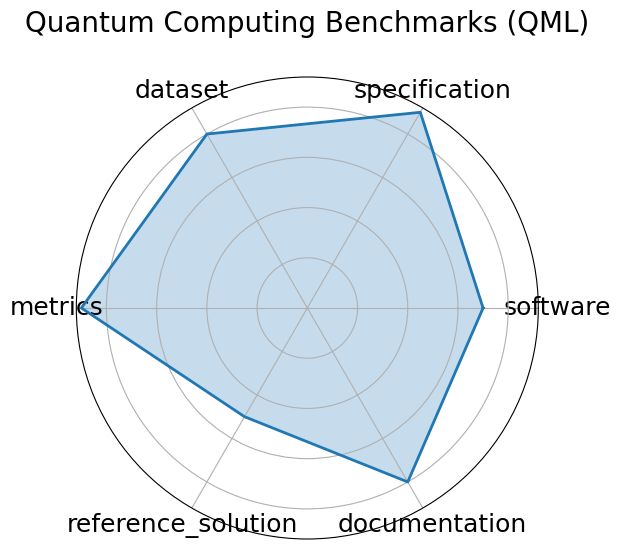

# Quantum Computing Benchmarks (QML)

**Date**: 2022-02-22

**Name**: Quantum Computing Benchmarks  QML 

**Domain**: Quantum Computing

**Focus**: Quantum algorithm performance evaluation

**Keywords**: quantum circuits, state preparation, error correction

**Task Types**: Circuit benchmarking, State classification

**Metrics**: Fidelity, Success probability

**Models**: IBM Q, IonQ, AQT@LBNL

**Citation**:

- Florian J. Kiwit, Marwa Marso, Philipp Ross, Carlos A. Riofrío, Johannes Klepsch, and Andre Luckow. Application-oriented benchmarking of quantum generative learning using quark. In 2023 IEEE International Conference on Quantum Computing and Engineering (QCE), 475 484. IEEE, September 2023. URL: http://dx.doi.org/10.1109/QCE57702.2023.00061, doi:10.1109/qce57702.2023.00061.

  - bibtex: |

      @inproceedings{kiwit2023,

        title={Application-Oriented Benchmarking of Quantum Generative Learning Using QUARK},

        url={http://dx.doi.org/10.1109/QCE57702.2023.00061},

        DOI={10.1109/qce57702.2023.00061},

        booktitle={2023 IEEE International Conference on Quantum Computing and Engineering (QCE)},

        publisher={IEEE},

        author={Kiwit, Florian J. and Marso, Marwa and Ross, Philipp and Riofrío, Carlos A. and Klepsch, Johannes and Luckow, Andre},

        year={2023},

        month=sep, pages={475-484}

      }

**Ratings:**

Specification:

  - **Rating:** 9

  - **Reason:** Tasks like fidelity estimation, state preparation, and runtime benchmarking are clearly defined; I/O formats vary slightly across hardware but are consistently framed in PennyLane/Qiskit ecosystems. 

Dataset:

  - **Rating:** 8

  - **Reason:** Datasets are accessible, structured, and interoperable via PennyLane; however, not all are versioned or richly annotated in conventional ML metadata standards. 

Metrics:

  - **Rating:** 9

  - **Reason:** Quantitative and well-motivated metrics  e.g., fidelity, success probability  are used, though reproducibility can depend on hardware noise profiles. 

Reference Solution:

  - **Rating:** 5

  - **Reason:** Reference implementations exist and are integrated into tools like PennyLane, but performance varies per backend; not all benchmarks include reproducible reference runs. 

Documentation:

  - **Rating:** 8

  - **Reason:** Strong integration with PennyLane and QML ecosystem; guides and code provided, but advanced hardware setup may pose reproducibility hurdles for newcomers. 

**Radar Plot:**
 