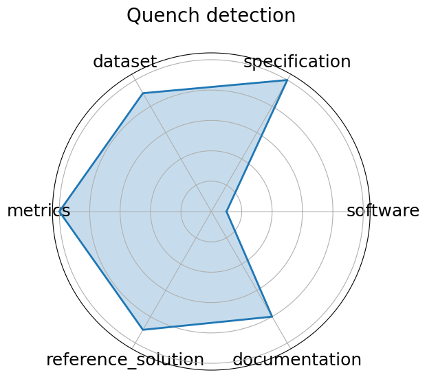

# Quench detection

**Date**: 2024-10-15

**Name**: Quench detection

**Domain**: Accelerators and Magnets

**Focus**: Real-time detection of superconducting magnet quenches using ML

**Keywords**: quench detection, autoencoder, anomaly detection, real-time

**Task Types**: Anomaly detection, Quench localization

**Metrics**: ROC-AUC, Detection latency

**Models**: Autoencoder, RL agents  in development 

**Citation**:

- Maira Khan, Steve Krave, Vittorio Marinozzi, Jennifer Ngadiuba, Stoyan Stoynev, and Nhan Tran. Benchmarking and interpreting real time quench detection algorithms. In Fast Machine Learning for Science Conference 2024. Purdue University, IN, October 2024. indico.cern.ch. URL: https://indico.cern.ch/event/1387540/contributions/6153618/attachments/2948441/5182077/fast_ml_magnets_2024_final.pdf.

  - bibtex: |

      @inproceedings{quench2024,

        author = {Maira Khan and Steve Krave and Vittorio Marinozzi and Jennifer Ngadiuba and Stoyan Stoynev and Nhan Tran},

        title = {Benchmarking and Interpreting Real Time Quench Detection Algorithms},

        booktitle = {Fast Machine Learning for Science Conference 2024},

        year = {2024},

        month = oct,

        address = {Purdue University, IN},

        publisher = {indico.cern.ch},

        url = {https://indico.cern.ch/event/1387540/contributions/6153618/attachments/2948441/5182077/fast_ml_magnets_2024_final.pdf}

      }

**Ratings:**

Specification:

  - **Rating:** 10.0

  - **Reason:** Real-time jet origin classification under FPGA constraints is clearly defined, with explicit latency targets  ~100 ns  and I/O formats. 

Dataset:

  - **Rating:** 9.0

  - **Reason:** Data available on Zenodo with DOI, includes constituent-level jets; accessible and well-documented, though not deeply versioned with full FAIR metadata. 

Metrics:

  - **Rating:** 10.0

  - **Reason:** Accuracy, latency, and hardware resource usage  LUTs, DSPs  are rigorously measured and aligned with real-time goals. 

Reference Solution:

  - **Rating:** 9.0

  - **Reason:** Includes models  MLP, Deep Sets, Interaction Networks  with quantization-aware training and synthesis results via hls4ml; reproducible but tightly coupled with specific toolchains. 

Documentation:

  - **Rating:** 8.0

  - **Reason:** Paper and code  via hls4ml  are sufficient, but a centralized, standalone repo for reproducing all models would enhance accessibility. 

**Radar Plot:**
 