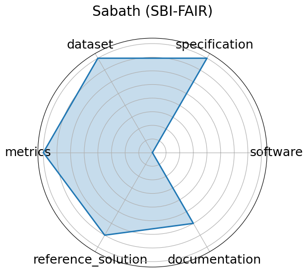

# Sabath (SBI-FAIR)


**Date**: 2021-09-27


**Name**: Sabath  SBI-FAIR 


**Domain**: Systems; Metadata


**Focus**: FAIR metadata framework for ML-driven surrogate workflows in HPC systems


**Keywords**: meta-benchmark, metadata, HPC, surrogate modeling


**Task Types**: Systems benchmarking


**Metrics**: Metadata completeness, FAIR compliance


**Models**: NA


**Citation**:


- Piotr Luszczek. Sabath: fair metadata technology for surrogate benchmarks. Technical Report, University of Tennessee, 2021. URL: https://github.com/icl-utk-edu/slip/tree/sabath.

  - bibtex:
      ```
      @techreport{luszczek2021sabath,

        title={SABATH: FAIR Metadata Technology for Surrogate Benchmarks},

        author={Luszczek, Piotr},

        year={2021},

        institution={University of Tennessee},

        url={https://github.com/icl-utk-edu/slip/tree/sabath}

      }

      ```

**Ratings:**


Software:


  - **Rating:** 4


  - **Reason:** Actively maintained GitHub repository  https://github.com/icl-utk-edu/slip/tree/sabath  with BSD-licensed tooling for FAIR metadata capture; integrates with existing surrogate modeling benchmarks. 


Specification:


  - **Rating:** 4


  - **Reason:** FAIR metadata structure and logging goals are clearly described. Input/output definitions are implied through integrations  e.g., MiniWeatherML , though not always formalized. 


Dataset:


  - **Rating:** 4


  - **Reason:** Datasets used in surrogate benchmarks are publicly available, well-structured, and FAIR-aligned, but not independently hosted by Sabath itself. 


Metrics:


  - **Rating:** 4


  - **Reason:** Emphasizes metadata completeness and FAIR compliance. Metrics are clear and well-matched to its metadata-focused benchmarking context. 


Reference Solution:


  - **Rating:** 3


  - **Reason:** Includes integration with multiple surrogate benchmarks and models, though not all are fully documented or packaged as standardized reference solutions. 


Documentation:


  - **Rating:** 3


  - **Reason:** Basic instructions and code are provided on GitHub, but more detailed walkthroughs, use-case examples, or tutorials are limited. 


**Average Rating:** 3.667


**Radar Plot:**
 