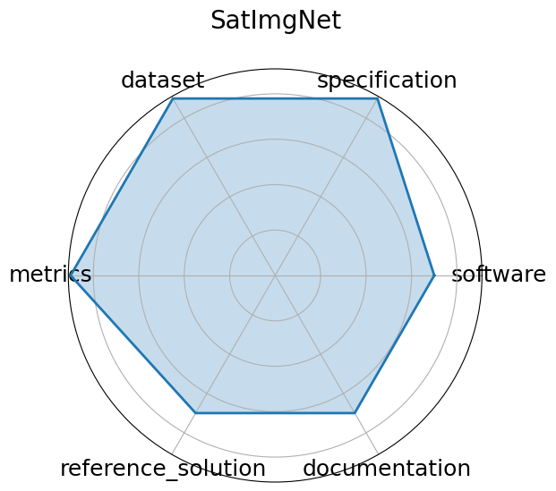

# SatImgNet

**Date**: 2023-04-23

**Name**: SatImgNet

**Domain**: Remote Sensing

**Focus**: Satellite imagery classification

**Keywords**: land-use, zero-shot, multi-task

**Task Types**: Image classification

**Metrics**: Accuracy

**Models**: CLIP, BLIP, ALBEF

**Citation**:

- Jonathan Roberts, Kai Han, and Samuel Albanie. Satin: a multi-task metadataset for classifying satellite imagery using vision-language models. 2023. URL: https://arxiv.org/abs/2304.11619, arXiv:2304.11619.

  - bibtex: |

      @misc{roberts2023satinmultitaskmetadatasetclassifying,

        title={SATIN: A Multi-Task Metadataset for Classifying Satellite Imagery using Vision-Language Models}, 

        author={Jonathan Roberts and Kai Han and Samuel Albanie},

        year={2023},

        eprint={2304.11619},

        archivePrefix={arXiv},

        primaryClass={cs.CV},

        url={https://arxiv.org/abs/2304.11619}, 

      }

**Ratings:**

Specification:

  - **Rating:** 9

  - **Reason:** Tasks  image classification across 27 satellite datasets  are clearly defined with multi-task and zero-shot framing; input/output structure is mostly standard but some task-specific nuances require interpretation. 

Dataset:

  - **Rating:** 9

  - **Reason:** Hosted on Hugging Face, versioned, FAIR-compliant with rich metadata; covers many well-known remote sensing datasets unified under one metadataset, though documentation depth varies slightly across tasks. 

Metrics:

  - **Rating:** 9

  - **Reason:** Standard quantitative metrics  Accuracy, Top-1 Accuracy  aligned with classification tasks; consistent across models, with leaderboard results available. 

Reference Solution:

  - **Rating:** 7

  - **Reason:** Baselines like CLIP, BLIP, ALBEF evaluated in the paper; full inference pipelines or training code may need reconstruction from paper or GitHub references. 

Documentation:

  - **Rating:** 7

  - **Reason:** Good usage guidance via Hugging Face and paper; example scripts and evaluation tools exist, but end-to-end reproducibility may require manual integration of model checkpoints and preprocessing. 

**Radar Plot:**
 