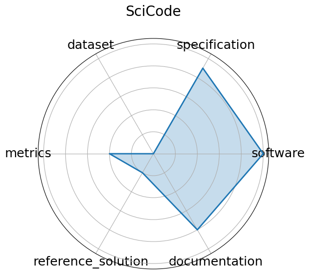

# SciCode

**Date**: 2024-07-18

**Name**: SciCode

**Domain**: Scientific Programming

**Focus**: Scientific code generation and problem solving

**Keywords**: code synthesis, scientific computing, programming benchmark

**Task Types**: Coding

**Metrics**: Solve rate  % 

**Models**: Claude3.5-Sonnet

**Citation**:

- Minyang Tian, Luyu Gao, Shizhuo Dylan Zhang, Xinan Chen, Cunwei Fan, Xuefei Guo, Roland Haas, Pan Ji, Kittithat Krongchon, Yao Li, Shengyan Liu, Di Luo, Yutao Ma, Hao Tong, Kha Trinh, Chenyu Tian, Zihan Wang, Bohao Wu, Yanyu Xiong, Shengzhu Yin, Minhui Zhu, Kilian Lieret, Yanxin Lu, Genglin Liu, Yufeng Du, Tianhua Tao, Ofir Press, Jamie Callan, Eliu Huerta, and Hao Peng. Scicode: a research coding benchmark curated by scientists. 2024. URL: https://arxiv.org/abs/2407.13168, arXiv:2407.13168.

  - bibtex: |

      @misc{tian2024scicoderesearchcodingbenchmark,

        archiveprefix = {arXiv},

        author        = {Minyang Tian and Luyu Gao and Shizhuo Dylan Zhang and Xinan Chen and Cunwei Fan and Xuefei Guo and Roland Haas and Pan Ji and Kittithat Krongchon and Yao Li and Shengyan Liu and Di Luo and Yutao Ma and Hao Tong and Kha Trinh and Chenyu Tian and Zihan Wang and Bohao Wu and Yanyu Xiong and Shengzhu Yin and Minhui Zhu and Kilian Lieret and Yanxin Lu and Genglin Liu and Yufeng Du and Tianhua Tao and Ofir Press and Jamie Callan and Eliu Huerta and Hao Peng},

        eprint        = {2407.13168},

        primaryclass  = {cs.AI},

        title         = {SciCode: A Research Coding Benchmark Curated by Scientists},

        url           = {https://arxiv.org/abs/2407.13168},

        year          = {2024}

      }

**Ratings:**

Specification:

  - **Rating:** 6

  - **Reason:** Expected outputs and broad types of inputs stated. Few details on output grading. No HW constraints. 

Dataset:

  - **Rating:** 0.5

  - **Reason:** Paper and website had no link to any dataset. It may still exist somewhere 

Metrics:

  - **Rating:** 4

  - **Reason:** Metrics stated, but not specified in detail 

Reference Solution:

  - **Rating:** 9

  - **Reason:** Models presented with scores 

Documentation:

  - **Rating:** 0.5

  - **Reason:** No specified way to reproduce the reference solution 

**Radar Plot:**
 