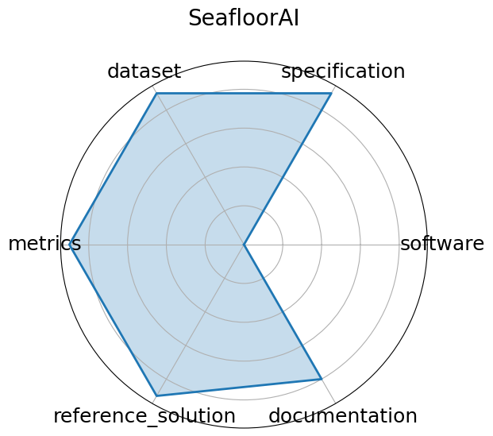

# SeafloorAI


**Edit:** [edit this entry](https://github.com/mlcommons-science/benchmark/tree/main/source)


**Date**: 2024-12-13


**Name**: SeafloorAI


**Domain**: Marine Science; Vision-Language


**Focus**: Large-scale vision-language dataset for seafloor mapping and geological classification


**Keywords**: sonar imagery, vision-language, seafloor mapping, segmentation, QA


**Task Types**: Image segmentation, Vision-language QA


**Metrics**: Segmentation pixel accuracy, QA accuracy


**Models**: SegFormer, ViLT-style multimodal models


**Citation**:


- Kien X. Nguyen, Fengchun Qiao, Arthur Trembanis, and Xi Peng. Seafloorai: a large-scale vision-language dataset for seafloor geological survey. 2024. URL: https://arxiv.org/abs/2411.00172, arXiv:2411.00172.

  - bibtex:
      ```
      @misc{nguyen2024seafloor,

        archiveprefix = {arXiv},

        author = {Kien X. Nguyen and Fengchun Qiao and Arthur Trembanis and Xi Peng},

        eprint = {2411.00172},

        primaryclass = {cs.CV},

        title = {SeafloorAI: A Large-scale Vision-Language Dataset for Seafloor Geological Survey},

        url = {https://arxiv.org/abs/2411.00172},

        year=2024

      }

      ```

**Ratings:**


Software:


  - **Rating:** 3


  - **Reason:** Data processing code is publicly available, but no full benchmark framework or runnable model implementations are provided yet. 


Specification:


  - **Rating:** 5


  - **Reason:** Tasks  image segmentation and vision-language QA  are clearly defined with geospatial and multimodal objectives well specified. 


Dataset:


  - **Rating:** 5


  - **Reason:** Large-scale, well-annotated sonar imagery dataset with segmentation masks and natural language descriptions; curated with domain experts. 


Metrics:


  - **Rating:** 5


  - **Reason:** Standard segmentation pixel accuracy and QA accuracy metrics are clearly specified and appropriate for the tasks. 


Reference Solution:


  - **Rating:** 4


  - **Reason:** Some baseline models  e.g., SegFormer, ViLT-style  are mentioned, but reproducible code or pretrained weights are not fully available yet. 


Documentation:


  - **Rating:** 4


  - **Reason:** Dataset description and data processing instructions are provided, but tutorials and benchmark usage guides are limited. 


**Average Rating:** 4.333


**Radar Plot:**
 