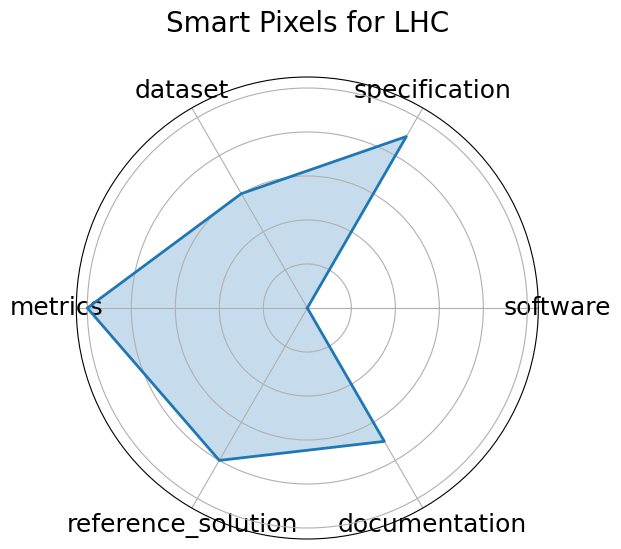

# Smart Pixels for LHC


**Date**: 2024-06-24


**Name**: Smart Pixels for LHC


**Domain**: Particle Physics; Instrumentation and Detectors


**Focus**: On-sensor, in-pixel ML filtering for high-rate LHC pixel detectors


**Keywords**: smart pixel, on-sensor inference, data reduction, trigger


**Task Types**: Image Classification, Data filtering


**Metrics**: Data rejection rate, Power per pixel


**Models**: 2-layer pixel NN


**Citation**:


- Benjamin Parpillon, Chinar Syal, Jieun Yoo, Jennet Dickinson, Morris Swartz, Giuseppe Di Guglielmo, Alice Bean, Douglas Berry, Manuel Blanco Valentin, Karri DiPetrillo, Anthony Badea, Lindsey Gray, Petar Maksimovic, Corrinne Mills, Mark S. Neubauer, Gauri Pradhan, Nhan Tran, Dahai Wen, and Farah Fahim. Smart pixels: in-pixel ai for on-sensor data filtering. 2024. URL: https://arxiv.org/abs/2406.14860, arXiv:2406.14860.

  - bibtex:
      ```
      @misc{parpillon2024smartpixelsinpixelai,

        archiveprefix = {arXiv},

        author        = {Benjamin Parpillon and Chinar Syal and Jieun Yoo and Jennet Dickinson and Morris Swartz and Giuseppe Di Guglielmo and Alice Bean and Douglas Berry and Manuel Blanco Valentin and Karri DiPetrillo and Anthony Badea and Lindsey Gray and Petar Maksimovic and Corrinne Mills and Mark S. Neubauer and Gauri Pradhan and Nhan Tran and Dahai Wen and Farah Fahim},

        eprint        = {2406.14860},

        primaryclass  = {physics.ins-det},

        title         = {Smart Pixels: In-pixel AI for on-sensor data filtering},

        url           = {https://arxiv.org/abs/2406.14860},

        year          = {2024}

      }

      ```

**Ratings:**


Software:


  - **Rating:** 2


  - **Reason:** No packaged code or setup scripts available; replication depends on hardware description and paper 


Specification:


  - **Rating:** 5


  - **Reason:** None 


Dataset:


  - **Rating:** 2


  - **Reason:** No dataset links; not publicly hosted or FAIR-compliant 


Metrics:


  - **Rating:** 5


  - **Reason:** None 


Reference Solution:


  - **Rating:** 3


  - **Reason:** In-pixel 2-layer NN described and evaluated, but reproducibility and source files are not released 


Documentation:


  - **Rating:** 3


  - **Reason:** Paper contains detailed descriptions, but no repo or external guide for reproducing results 


**Average Rating:** 3.333


**Radar Plot:**
 