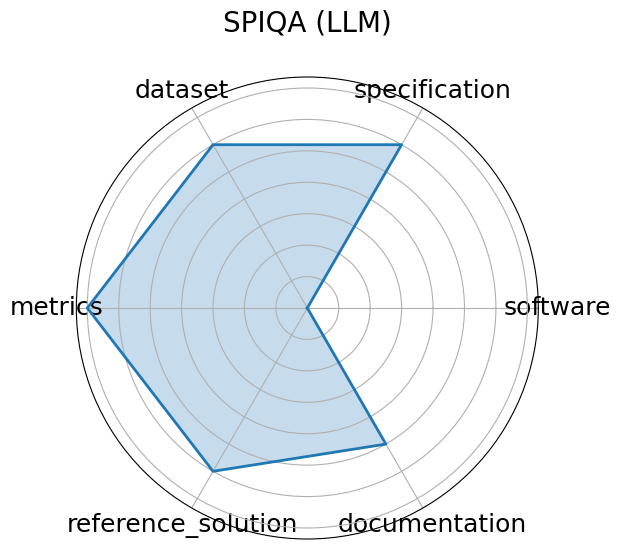

# SPIQA (LLM)


**Edit:** [edit this entry](https://github.com/mlcommons-science/benchmark/tree/main/source)


**Date**: 2024-12-13


**Name**: SPIQA  LLM 


**Domain**: Multimodal Scientific QA; Computer Vision


**Focus**: Evaluating LLMs on image-based scientific paper figure QA tasks  LLM Adapter performance 


**Keywords**: multimodal QA, scientific figures, image+text, chain-of-thought prompting


**Task Types**: Multimodal QA


**Metrics**: Accuracy, F1 score


**Models**: LLaVA, MiniGPT-4, Owl-LLM adapter variants


**Citation**:


- Shraman Pramanick, Rama Chellappa, and Subhashini Venugopalan. Spiqa: a dataset for multimodal question answering on scientific papers. 2025. URL: https://arxiv.org/abs/2407.09413, arXiv:2407.09413.

  - bibtex:
      ```
      @misc{pramanick2025spiqadatasetmultimodalquestion,

        title={SPIQA: A Dataset for Multimodal Question Answering on Scientific Papers}, 

        author={Shraman Pramanick and Rama Chellappa and Subhashini Venugopalan},

        year={2025},

        eprint={2407.09413},

        archivePrefix={arXiv},

        primaryClass={cs.CL},

        url={https://arxiv.org/abs/2407.09413}, 

      }

      ```

**Ratings:**


Software:


  - **Rating:** 5


  - **Reason:** Well-documented codebase available on Github 


Specification:


  - **Rating:** 3.5


  - **Reason:** Task of QA over scientific figures is sufficient but not fully formalized in input/output terms. No hawrdware constraints. 


Dataset:


  - **Rating:** 5


  - **Reason:** Full dataset available on Hugging Face with train/test/valid splits. 


Metrics:


  - **Rating:** 4


  - **Reason:** Reports accuracy and F1; fair but no visual reasoning-specific metric. 


Reference Solution:


  - **Rating:** 4


  - **Reason:** 10 LLM adapter baselines; results included without constraints. 


Documentation:


  - **Rating:** 5


  - **Reason:** Full paper available 


**Average Rating:** 4.417


**Radar Plot:**
 