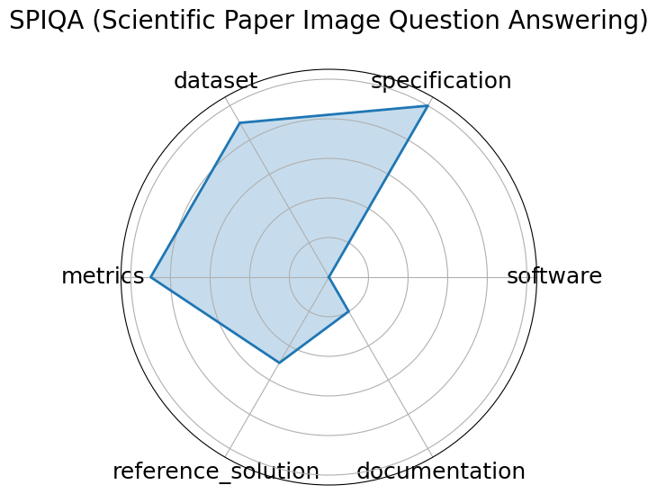

# SPIQA (Scientific Paper Image Question Answering)


**Edit:** [edit this entry](https://github.com/mlcommons-science/benchmark/tree/main/source)


**Date**: 2024-07-12


**Name**: SPIQA  Scientific Paper Image Question Answering 


**Domain**: Computer Science


**Focus**: Multimodal QA on scientific figures


**Keywords**: multimodal QA, figure understanding, table comprehension, chain-of-thought


**Task Types**: Question answering, Multimodal QA, Chain-of-Thought evaluation


**Metrics**: Accuracy, F1 score


**Models**: Chain-of-Thought models, Multimodal QA systems


**Citation**:


- Xiaoyan Zhong, Yijian Gao, and Suchin Gururangan. Spiqa: scientific paper image question answering. 2024. URL: https://arxiv.org/abs/2407.09413.

  - bibtex:
      ```
      @misc{zhong2024spiqa,

        title={SPIQA: Scientific Paper Image Question Answering},

        author={Zhong, Xiaoyan and Gao, Yijian and Gururangan, Suchin},

        year={2024},

        url={https://arxiv.org/abs/2407.09413}

      }

      ```

**Ratings:**


Software:


  - **Rating:** 0


  - **Reason:** Not provided 


Specification:


  - **Rating:** 5


  - **Reason:** Task administration clearly defined; prompt instructions explicitly given, no ambiguity in format or scope. 


Dataset:


  - **Rating:** 4.5


  - **Reason:** Dataset is available  via paper/appendix , includes train/test/valid split. FAIR-compliant with minor gaps in versioning or access standardization. 


Metrics:


  - **Rating:** 5


  - **Reason:** Uses quantitative metrics  Accuracy, F1  aligned with the task 


Reference Solution:


  - **Rating:** 2


  - **Reason:** Multiple model results  e.g., GPT-4V, Gemini  reported; baselines exist, but full runnable code not confirmed for all. 


Documentation:


  - **Rating:** 5


  - **Reason:** All information provided in paper 


**Average Rating:** 3.583


**Radar Plot:**
 