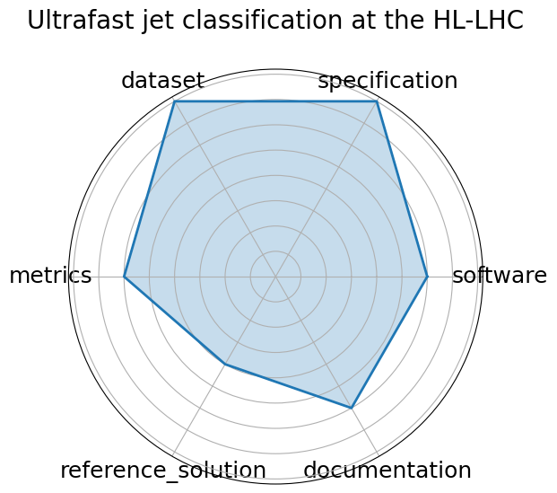

# Ultrafast jet classification at the HL-LHC


**Date**: 2024-07-08


**Name**: Ultrafast jet classification at the HL-LHC


**Domain**: Particle Physics


**Focus**: FPGA-optimized real-time jet origin classification at the HL-LHC


**Keywords**: jet classification, FPGA, quantization-aware training, Deep Sets, Interaction Networks


**Task Types**: Classification


**Metrics**: Accuracy, Latency, Resource utilization


**Models**: MLP, Deep Sets, Interaction Network


**Citation**:


- Patrick Odagiu, Zhiqiang Que, Javier Duarte, Johannes Haller, Gregor Kasieczka, Artur Lobanov, Vladimir Loncar, Wayne Luk, Jennifer Ngadiuba, Maurizio Pierini, Philipp Rincke, Arpita Seksaria, Sioni Summers, Andre Sznajder, Alexander Tapper, and Thea K. Aarrestad. Ultrafast jet classification on fpgas for the hl-lhc. 2024. URL: https://arxiv.org/abs/2402.01876, arXiv:2402.01876, doi:https://doi.org/10.1088/2632-2153/ad5f10.

  - bibtex:
      ```
      @misc{odagiu2024ultrafastjetclassificationfpgas,

        archiveprefix = {arXiv},

        author        = {Patrick Odagiu and Zhiqiang Que and Javier Duarte and Johannes Haller and Gregor Kasieczka and Artur Lobanov and Vladimir Loncar and Wayne Luk and Jennifer Ngadiuba and Maurizio Pierini and Philipp Rincke and Arpita Seksaria and Sioni Summers and Andre Sznajder and Alexander Tapper and Thea K. Aarrestad},

        doi           = {https://doi.org/10.1088/2632-2153/ad5f10},

        eprint        = {2402.01876},

        primaryclass  = {hep-ex},

        title         = {Ultrafast jet classification on FPGAs for the HL-LHC},

        url           = {https://arxiv.org/abs/2402.01876},

        year          = {2024}

      }

      ```

**Ratings:**


Software:


  - **Rating:** 3


  - **Reason:** Not containerized; Setup and automation incomplete 


Specification:


  - **Rating:** 4


  - **Reason:** Hardware constraints are referenced but not fully detailed or standardized 


Dataset:


  - **Rating:** 4


  - **Reason:** FAIR metadata limited; no clear mention of dataset format or splits 


Metrics:


  - **Rating:** 3


  - **Reason:** Metrics exist  accuracy, latency, utilization , but formal definitions and evaluation guidance are limited 


Reference Solution:


  - **Rating:** 2


  - **Reason:** Reference implementations not fully reproducible; no evaluation pipeline or training setup provided 


Documentation:


  - **Rating:** 3


  - **Reason:** No linked GitHub repo or setup instructions; paper provides partial guidance only 


**Average Rating:** 3.167


**Radar Plot:**
 