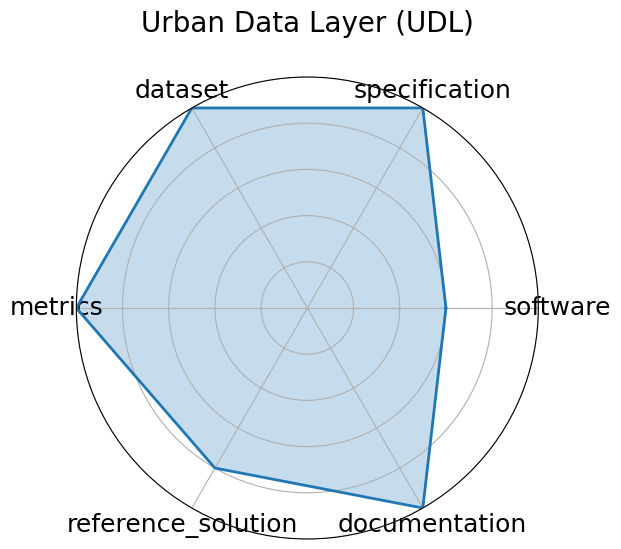

# Urban Data Layer (UDL)


**Date**: 2024-12-13


**Name**: Urban Data Layer  UDL 


**Domain**: Urban Computing; Data Engineering


**Focus**: Unified data pipeline for multi-modal urban science research


**Keywords**: data pipeline, urban science, multi-modal, benchmark


**Task Types**: Prediction, Classification


**Metrics**: Task-specific accuracy or RMSE


**Models**: Baseline regression/classification pipelines


**Citation**:


- Yiheng Wang, Tianyu Wang, Yuying Zhang, Hongji Zhang, Haoyu Zheng, Guanjie Zheng, and Linghe Kong. Urbandatalayer: a unified data pipeline for urban science. In A. Globerson, L. Mackey, D. Belgrave, A. Fan, U. Paquet, J. Tomczak, and C. Zhang, editors, Advances in Neural Information Processing Systems, volume 37, 7296–7310. Curran Associates, Inc., 2024. URL: https://proceedings.neurips.cc/paper_files/paper/2024/file/0db7f135f6991e8cec5e516ecc66bfba-Paper-Datasets_and_Benchmarks_Track.pdf.

  - bibtex:
      ```
      @inproceedings{neurips2024_0db7f135,

        author = {Wang, Yiheng and Wang, Tianyu and Zhang, Yuying and Zhang, Hongji and Zheng, Haoyu and Zheng, Guanjie and Kong, Linghe},

        booktitle = {Advances in Neural Information Processing Systems},

        editor = {A. Globerson and L. Mackey and D. Belgrave and A. Fan and U. Paquet and J. Tomczak and C. Zhang},

        pages = {7296--7310},

        publisher = {Curran Associates, Inc.},

        title = {UrbanDataLayer: A Unified Data Pipeline for Urban Science},

        url = {https://proceedings.neurips.cc/paper_files/paper/2024/file/0db7f135f6991e8cec5e516ecc66bfba-Paper-Datasets_and_Benchmarks_Track.pdf},

        volume = {37},

        year = {2024}

      }

      ```

**Ratings:**


Software:


  - **Rating:** 3


  - **Reason:** Source code is publicly available on GitHub; baseline regression and classification pipelines are included but framework maturity is moderate. 


Specification:


  - **Rating:** 5


  - **Reason:** Multiple urban science tasks like prediction and classification are well specified with clear input/output and evaluation criteria. 


Dataset:


  - **Rating:** 5


  - **Reason:** Large, multi-modal urban datasets are open-source, well-documented, and support reproducible research. 


Metrics:


  - **Rating:** 5


  - **Reason:** Uses task-specific accuracy and RMSE metrics appropriate for prediction and classification. 


Reference Solution:


  - **Rating:** 4


  - **Reason:** Baseline models available but not exhaustive; community adoption and extensions expected. 


Documentation:


  - **Rating:** 5


  - **Reason:** GitHub repository and conference poster provide comprehensive code and reproducibility instructions. 


**Average Rating:** 4.5


**Radar Plot:**
 