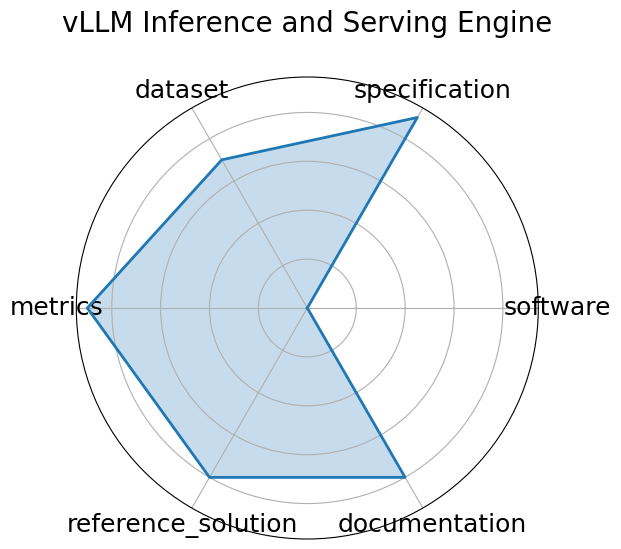

# vLLM Inference and Serving Engine

**Date**: 2023-09-12

**Name**: vLLM Inference and Serving Engine

**Domain**: LLM; HPC/inference

**Focus**: High-throughput, memory-efficient inference and serving engine for LLMs

**Keywords**: LLM inference, PagedAttention, CUDA graph, streaming API, quantization

**Task Types**: Inference Benchmarking

**Metrics**: Tokens/sec, Time to First Token  TTFT , Memory footprint

**Models**: LLaMA, Mixtral, FlashAttention-based models

**Citation**:

- Woosuk Kwon, Zhuohan Li, Siyuan Zhuang, Ying Sheng, Lianmin Zheng, Cody Hao Yu, Joseph Gonzalez, Hao Zhang, and Ion Stoica. Efficient memory management for large language model serving with pagedattention. In Proceedings of the 29th Symposium on Operating Systems Principles, SOSP '23, 611 626. New York, NY, USA, 2023. Association for Computing Machinery. URL: https://doi.org/10.1145/3600006.3613165, doi:10.1145/3600006.3613165.

  - bibtex: |

      @inproceedings{10.1145/3600006.3613165,

        author = {Kwon, Woosuk and Li, Zhuohan and Zhuang, Siyuan and Sheng, Ying and Zheng, Lianmin and Yu, Cody Hao and Gonzalez, Joseph and Zhang, Hao and Stoica, Ion},

        title = {Efficient Memory Management for Large Language Model Serving with PagedAttention},

        year = {2023},

        publisher = {Association for Computing Machinery},

        address = {New York, NY, USA},

        url = {https://doi.org/10.1145/3600006.3613165},

        doi = {10.1145/3600006.3613165},

        abstract = {High throughput serving of large language models (LLMs) requires batching sufficiently many requests at a time. However, existing systems struggle because the key-value cache (KV cache) memory for each request is huge and grows and shrinks dynamically. When managed inefficiently, this memory can be significantly wasted by fragmentation and redundant duplication, limiting the batch size. To address this problem, we propose PagedAttention, an attention algorithm inspired by the classical virtual memory and paging techniques in operating systems. On top of it, we build vLLM, an LLM serving system that achieves (1) near-zero waste in KV cache memory and (2) flexible sharing of KV cache within and across requests to further reduce memory usage. Our evaluations show that vLLM improves the throughput of popular LLMs by 2--4\texttimes{} with the same level of latency compared to the state-of-the-art systems, such as FasterTransformer and Orca. The improvement is more pronounced with longer sequences, larger models, and more complex decoding algorithms. vLLM's source code is publicly available at https://github.com/vllm-project/vllm.},

        booktitle = {Proceedings of the 29th Symposium on Operating Systems Principles},

        pages = {611-626},

        numpages = {16},

        location = {Koblenz, Germany},

        series = {SOSP '23}

      }

**Ratings:**

Specification:

  - **Rating:** 9.0

  - **Reason:** Benchmarks hardware performance of LLM inference across multiple platforms with well-defined input/output and platform constraints. 

Dataset:

  - **Rating:** 7.0

  - **Reason:** Uses structured log files and configs instead of conventional datasets; suitable for inference benchmarking. 

Metrics:

  - **Rating:** 9.0

  - **Reason:** Clear throughput, latency, and utilization metrics; platform comparison dashboard enhances evaluation. 

Reference Solution:

  - **Rating:** 8.0

  - **Reason:** Includes reproducible scripts and example runs; models like LLaMA and Mistral are referenced with platform-specific configs. 

Documentation:

  - **Rating:** 8.0

  - **Reason:** GitHub contains clear instructions, platform details, and framework comparisons. 

**Radar Plot:**
 