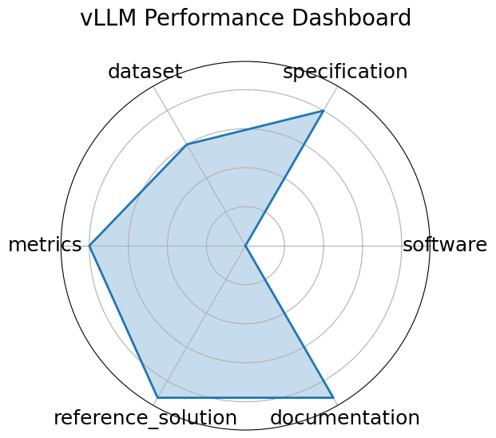

# vLLM Performance Dashboard


**Edit:** [edit this entry](https://github.com/mlcommons-science/benchmark/tree/main/source)


**Date**: 2022-06-22


**Name**: vLLM Performance Dashboard


**Domain**: LLM; HPC/inference


**Focus**: Interactive dashboard showing inference performance of vLLM


**Keywords**: Dashboard, Throughput visualization, Latency analysis, Metric tracking


**Task Types**: Performance visualization


**Metrics**: Tokens/sec, TTFT, Memory usage


**Models**: LLaMA-2, Mistral, Qwen


**Citation**:


- Simon Mo. Vllm performance dashboard. 2024. URL: https://simon-mo-workspace.observablehq.cloud/vllm-dashboard-v0/.

  - bibtex:
      ```
      @misc{mo2024vllm_dashboard,

        title={vLLM Performance Dashboard},

        author={Mo, Simon},

        year={2024},

        url={https://simon-mo-workspace.observablehq.cloud/vllm-dashboard-v0/}

      }

      ```

**Ratings:**


Software:


  - **Rating:** 4


  - **Reason:** Interactive dashboard built with ObservableHQ and linked to vLLM benchmarks. Source code is not fully open, but backend integration with vLLM is well-maintained. 


Specification:


  - **Rating:** 4


  - **Reason:** While primarily a visualization tool, it includes benchmark configurations, metric definitions, and supports comparison across models and hardware. 


Dataset:


  - **Rating:** 2


  - **Reason:** No datasets are bundled; the dashboard visualizes metrics derived from model inference logs or external endpoints, not a formal dataset. 


Metrics:


  - **Rating:** 4


  - **Reason:** Tracks tokens/sec, TTFT, memory usage, and platform comparisons. Metrics are clear but focused on visualization rather than statistical robustness. 


Reference Solution:


  - **Rating:** 3


  - **Reason:** Dashboards include reproducible views of benchmarked models, but do not ship with runnable model code. Relies on external serving infrastructure. 


Documentation:


  - **Rating:** 4


  - **Reason:** Public dashboard with instructions and tooltips; documentation is clear, though access is restricted  login required  and backend setup is opaque to users. 


**Average Rating:** 3.5


**Radar Plot:**
 