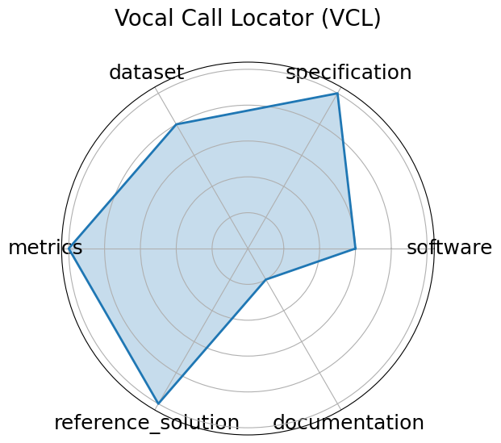

# Vocal Call Locator (VCL)


**Date**: 2024-12-13


**Name**: Vocal Call Locator  VCL 


**Domain**: Neuroscience; Bioacoustics


**Focus**: Benchmarking sound-source localization of rodent vocalizations from multi-channel audio


**Keywords**: source localization, bioacoustics, time-series, SSL


**Task Types**: Sound source localization


**Metrics**: Localization error  cm , Recall/Precision


**Models**: CNN-based SSL models


**Citation**:


- Ralph E Peterson, Aramis Tanelus, Christopher Ick, Bartul Mimica, Niegil Francis, Violet J Ivan, Aman Choudhri, Annegret L Falkner, Mala Murthy, David M Schneider, Dan H Sanes, and Alex H Williams. Vocal call locator benchmark (vcl) for localizing rodent vocalizations from multi-channel audio. In A. Globerson, L. Mackey, D. Belgrave, A. Fan, U. Paquet, J. Tomczak, and C. Zhang, editors, Advances in Neural Information Processing Systems, volume 37, 106370–106382. Curran Associates, Inc., 2024. URL: https://proceedings.neurips.cc/paper_files/paper/2024/file/c00d37d6b04d73b870b963a4d70051c1-Paper-Datasets_and_Benchmarks_Track.pdf.

  - bibtex:
      ```
      @inproceedings{neurips2024_c00d37d6,

        author = {Peterson, Ralph E and Tanelus, Aramis and Ick, Christopher and Mimica, Bartul and Francis, Niegil and Ivan, Violet J and Choudhri, Aman and Falkner, Annegret L and Murthy, Mala and Schneider, David M and Sanes, Dan H and Williams, Alex H},

        booktitle = {Advances in Neural Information Processing Systems},

        editor = {A. Globerson and L. Mackey and D. Belgrave and A. Fan and U. Paquet and J. Tomczak and C. Zhang},

        pages = {106370--106382},

        publisher = {Curran Associates, Inc.},

        title = {Vocal Call Locator Benchmark (VCL) for localizing rodent vocalizations from multi-channel audio},

        url = {https://proceedings.neurips.cc/paper_files/paper/2024/file/c00d37d6b04d73b870b963a4d70051c1-Paper-Datasets_and_Benchmarks_Track.pdf},

        volume = {37},

        year = {2024}

      }

      ```

**Ratings:**


Software:


  - **Rating:** 3


  - **Reason:** Some baseline CNN models for sound source localization are reported, but no publicly available or fully integrated runnable codebase yet. 


Specification:


  - **Rating:** 5


  - **Reason:** Well-defined localization tasks with multiple scenarios and real-world environment conditions; input/output formats clearly described. 


Dataset:


  - **Rating:** 4


  - **Reason:** Large-scale audio dataset covering real and simulated data with standardized splits, though exact data formats are not fully detailed. 


Metrics:


  - **Rating:** 5


  - **Reason:** Includes localization error, precision, recall, and other relevant metrics for robust evaluation. 


Reference Solution:


  - **Rating:** 5


  - **Reason:** Multiple baselines evaluated over diverse models and architectures, supporting reproducibility of benchmark comparisons. 


Documentation:


  - **Rating:** 1


  - **Reason:** Methodology and paper are thorough, but setup instructions and runnable code are not publicly provided, limiting user onboarding. 


**Average Rating:** 3.833


**Radar Plot:**
 