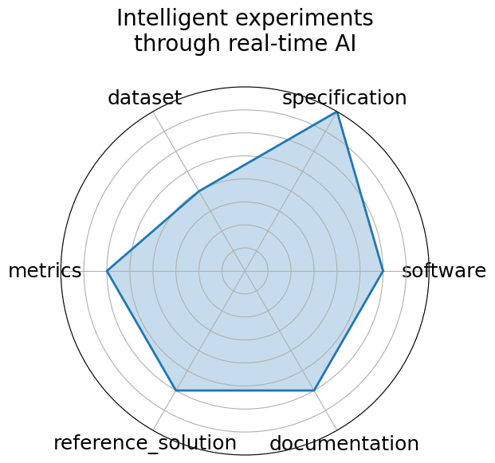

# Intelligent experiments through real-time AI

**Date**: 2025-01-08

**Name**: Intelligent experiments through real-time AI

**Domain**: Instrumentation and Detectors; Nuclear Physics; Particle Physics

**Focus**: Real-time FPGA-based triggering and detector control for sPHENIX and future EIC

**Keywords**: FPGA, Graph Neural Network, hls4ml, real-time inference, detector control

**Task Types**: Trigger classification, Detector control, Real-time inference

**Metrics**: Accuracy  charm and beauty detection , Latency  µs , Resource utilization  LUT/FF/BRAM/DSP 

**Models**: Bipartite Graph Network with Set Transformers  BGN-ST , GarNet  edge-classifier 

**Citation**:

- J. Kvapil, G. Borca-Tasciuc, H. Bossi, K. Chen, Y. Chen, Y. Corrales Morales, H. Da Costa, C. Da Silva, C. Dean, J. Durham, S. Fu, C. Hao, P. Harris, O. Hen, H. Jheng, Y. Lee, P. Li, X. Li, Y. Lin, M. X. Liu, V. Loncar, J. P. Mitrevski, A. Olvera, M. L. Purschke, J. S. Renck, G. Roland, J. Schambach, Z. Shi, N. Tran, N. Wuerfel, B. Xu, D. Yu, and H. Zhang. Intelligent experiments through real-time ai: fast data processing and autonomous detector control for sphenix and future eic detectors. 2025. URL: https://arxiv.org/abs/2501.04845, arXiv:2501.04845.

  - bibtex: |

      @misc{kvapil2025intelligentexperimentsrealtimeai,

        archiveprefix={arXiv},

        author={J. Kvapil and G. Borca-Tasciuc and H. Bossi and K. Chen and Y. Chen and Y. Corrales Morales and H. Da Costa and C. Da Silva and C. Dean and J. Durham and S. Fu and C. Hao and P. Harris and O. Hen and H. Jheng and Y. Lee and P. Li and X. Li and Y. Lin and M. X. Liu and V. Loncar and J. P. Mitrevski and A. Olvera and M. L. Purschke and J. S. Renck and G. Roland and J. Schambach and Z. Shi and N. Tran and N. Wuerfel and B. Xu and D. Yu and H. Zhang},

        eprint={2501.04845},

        primaryclass={physics.ins-det},

        title={Intelligent experiments through real-time AI: Fast Data Processing and Autonomous Detector Control for sPHENIX and future EIC detectors},

        url={https://arxiv.org/abs/2501.04845},

        year={2025}

      }

**Ratings:**

Specification:

  - **Rating:** 8.0

  - **Reason:** Task  trigger-level anomaly detection  is clearly defined for low-latency streaming input, but the problem framing lacks complete architectural/system specs.

Dataset:

  - **Rating:** 6.0

  - **Reason:** Internal DUNE SONIC data; not publicly released and no formal FAIR support; replicability is institutionally gated.

Metrics:

  - **Rating:** 7.0

  - **Reason:** Metrics include detection efficiency and latency, which are relevant, but only lightly supported by baselines or formal eval scripts.

Reference Solution:

  - **Rating:** 5.0

  - **Reason:** One CNN prototype demonstrated; LSTM planned. No public implementation or ready-to-run example yet.

Documentation:

  - **Rating:** 6.0

  - **Reason:** Slides and some internal documentation exist, but no full pipeline or public GitHub repo yet.

**Radar Plot:**
 