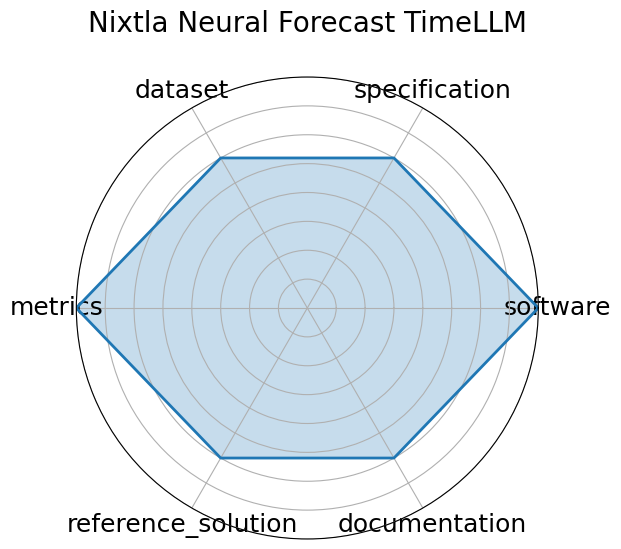

# Nixtla Neural Forecast TimeLLM

**Date**: 2023-10-03

**Name**: Nixtla Neural Forecast TimeLLM

**Domain**: Time-series; General ML

**Focus**: Reprogramming LLMs for time series forecasting

**Keywords**: Time-LLM, language model, time-series, reprogramming

**Task Types**: Time-series forecasting

**Metrics**: RMSE, MAPE

**Models**: Time‑LLM

**Citation**:

- Ming Jin, Shiyu Wang, Lintao Ma, Zhixuan Chu, James Y. Zhang, Xiaoming Shi, Pin-Yu Chen, Yuxuan Liang, Yuan-Fang Li, Shirui Pan, and Qingsong Wen. Time-llm: time series forecasting by reprogramming large language models. 2024. URL: https://arxiv.org/abs/2310.01728, arXiv:2310.01728.

  - bibtex: |

      @misc{jin2024timellmtimeseriesforecasting,

        title={Time-LLM: Time Series Forecasting by Reprogramming Large Language Models}, 

        author={Ming Jin and Shiyu Wang and Lintao Ma and Zhixuan Chu and James Y. Zhang and Xiaoming Shi and Pin-Yu Chen and Yuxuan Liang and Yuan-Fang Li and Shirui Pan and Qingsong Wen},

        year={2024},

        eprint={2310.01728},

        archivePrefix={arXiv},

        primaryClass={cs.LG},

        url={https://arxiv.org/abs/2310.01728}, 

      }

**Ratings:**

Specification:

  - **Rating:** 7.0

  - **Reason:** Describes forecasting with LLMs, but less formal on input/output or task framing.

Dataset:

  - **Rating:** 6.0

  - **Reason:** Uses open time series datasets, but lacks a consolidated data release or splits.

Metrics:

  - **Rating:** 7.0

  - **Reason:** Reports metrics like MASE and SMAPE, standard in forecasting.

Reference Solution:

  - **Rating:** 6.0

  - **Reason:** Provides TimeLLM with open source, but no other baselines included.

Documentation:

  - **Rating:** 6.0

  - **Reason:** GitHub readme with installation and example usage; lacks API or extensive tutorials.

**Radar Plot:**
 