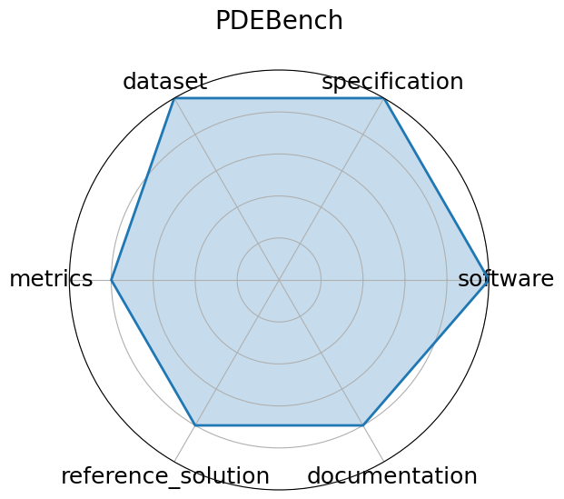

# PDEBench

**Date**: 2022-10-13

**Name**: PDEBench

**Domain**: CFD; Weather Modeling

**Focus**: Benchmark suite for ML-based surrogates solving time-dependent PDEs

**Keywords**: PDEs, CFD, scientific ML, surrogate modeling, NeurIPS

**Task Types**: Supervised Learning

**Metrics**: RMSE, boundary RMSE, Fourier RMSE

**Models**: FNO, U-Net, PINN, Gradient-Based inverse methods

**Citation**:

- Makoto Takamoto, Timothy Praditia, Raphael Leiteritz, Dan MacKinlay, Francesco Alesiani, Dirk Pflüger, and Mathias Niepert. Pdebench: an extensive benchmark for scientific machine learning. 2024. URL: https://arxiv.org/abs/2210.07182, arXiv:2210.07182.

  - bibtex: |

      @misc{takamoto2024pdebenchextensivebenchmarkscientific,

        archiveprefix = {arXiv},

        author        = {Makoto Takamoto and Timothy Praditia and Raphael Leiteritz and Dan MacKinlay and Francesco Alesiani and Dirk Pflüger and Mathias Niepert},

        eprint        = {2210.07182},

        primaryclass  = {cs.LG},

        title         = {PDEBENCH: An Extensive Benchmark for Scientific Machine Learning},

        url           = {https://arxiv.org/abs/2210.07182},

        year          = {2024}

      }

**Ratings:**

Specification:

  - **Rating:** 9.0

  - **Reason:** Clearly defined PDE-solving tasks with well-specified constraints and solution formats.

Dataset:

  - **Rating:** 9.0

  - **Reason:** Includes synthetic and real-world PDE datasets with detailed format descriptions.

Metrics:

  - **Rating:** 8.0

  - **Reason:** Uses L2 error and other norms relevant to PDE solutions.

Reference Solution:

  - **Rating:** 7.0

  - **Reason:** Includes baseline solvers and trained models across multiple PDE tasks.

Documentation:

  - **Rating:** 8.0

  - **Reason:** Well-organized GitHub with examples, dataset loading scripts, and training configs.

**Radar Plot:**
 