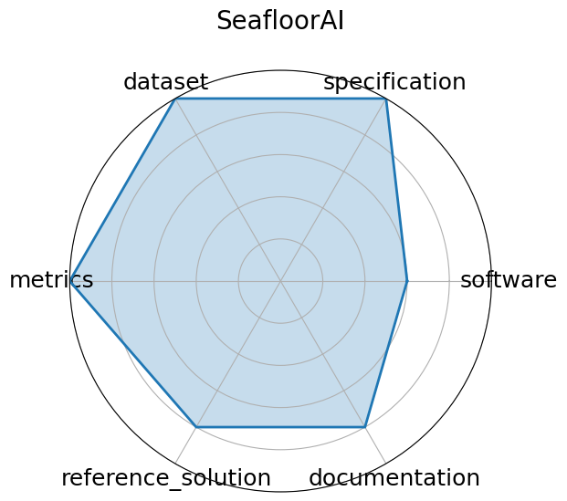

# SeafloorAI

**Date**: 2024-12-13

**Name**: SeafloorAI

**Domain**: Marine Science; Vision-Language

**Focus**: Large-scale vision-language dataset for seafloor mapping and geological classification

**Keywords**: sonar imagery, vision-language, seafloor mapping, segmentation, QA

**Task Types**: Image segmentation, Vision-language QA

**Metrics**: Segmentation pixel accuracy, QA accuracy

**Models**: SegFormer, ViLT-style multimodal models

**Citation**:

- Kien X. Nguyen, Fengchun Qiao, Arthur Trembanis, and Xi Peng. Seafloorai: a large-scale vision-language dataset for seafloor geological survey. 2024. URL: https://arxiv.org/abs/2411.00172, arXiv:2411.00172.

  - bibtex: |

      @misc{nguyen2024seafloor,

        archiveprefix = {arXiv},

        author = {Kien X. Nguyen and Fengchun Qiao and Arthur Trembanis and Xi Peng},

        eprint = {2411.00172},

        primaryclass = {cs.CV},

        title = {SeafloorAI: A Large-scale Vision-Language Dataset for Seafloor Geological Survey},

        url = {https://arxiv.org/abs/2411.00172},

        year=2024

      }

**Ratings:**

Specification:

  - **Rating:** 9.0

  - **Reason:** Real-time qubit classification task clearly defined in quantum instrumentation context.

Dataset:

  - **Rating:** 9.0

  - **Reason:** Dataset available on Zenodo with signal traces; compact and reproducible.

Metrics:

  - **Rating:** 9.0

  - **Reason:** Accuracy and latency are well defined and crucial in this setting.

Reference Solution:

  - **Rating:** 9.0

  - **Reason:** GitHub repo has reproducible code and HLS firmware targeting FPGA.

Documentation:

  - **Rating:** 8.0

  - **Reason:** Good setup instructions, but no interactive visualization or starter notebook.

**Radar Plot:**
 