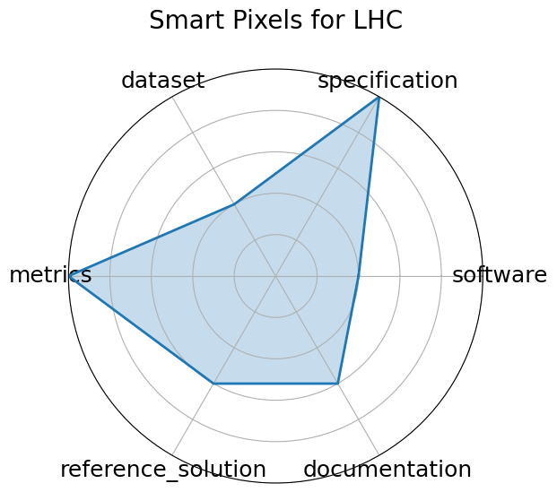

# Smart Pixels for LHC

**Date**: 2024-06-24

**Name**: Smart Pixels for LHC

**Domain**: Particle Physics; Instrumentation and Detectors

**Focus**: On-sensor, in-pixel ML filtering for high-rate LHC pixel detectors

**Keywords**: smart pixel, on-sensor inference, data reduction, trigger

**Task Types**: Image Classification, Data filtering

**Metrics**: Data rejection rate, Power per pixel

**Models**: 2-layer pixel NN

**Citation**:

- Benjamin Parpillon, Chinar Syal, Jieun Yoo, Jennet Dickinson, Morris Swartz, Giuseppe Di Guglielmo, Alice Bean, Douglas Berry, Manuel Blanco Valentin, Karri DiPetrillo, Anthony Badea, Lindsey Gray, Petar Maksimovic, Corrinne Mills, Mark S. Neubauer, Gauri Pradhan, Nhan Tran, Dahai Wen, and Farah Fahim. Smart pixels: in-pixel ai for on-sensor data filtering. 2024. URL: https://arxiv.org/abs/2406.14860, arXiv:2406.14860.

  - bibtex: |

      @misc{parpillon2024smartpixelsinpixelai,

        archiveprefix = {arXiv},

        author        = {Benjamin Parpillon and Chinar Syal and Jieun Yoo and Jennet Dickinson and Morris Swartz and Giuseppe Di Guglielmo and Alice Bean and Douglas Berry and Manuel Blanco Valentin and Karri DiPetrillo and Anthony Badea and Lindsey Gray and Petar Maksimovic and Corrinne Mills and Mark S. Neubauer and Gauri Pradhan and Nhan Tran and Dahai Wen and Farah Fahim},

        eprint        = {2406.14860},

        primaryclass  = {physics.ins-det},

        title         = {Smart Pixels: In-pixel AI for on-sensor data filtering},

        url           = {https://arxiv.org/abs/2406.14860},

        year          = {2024}

      }

**Ratings:**

Specification:

  - **Rating:** 9.0

  - **Reason:** Task  automated neural architecture search for real-time physics  is well formulated with clear latency, model compression, and deployment goals.

Dataset:

  - **Rating:** 6.0

  - **Reason:** Internal Bragg and jet datasets used; not publicly hosted or FAIR-compliant, though mentioned in the paper.

Metrics:

  - **Rating:** 10.0

  - **Reason:** BOP reduction, latency, and accuracy are all quantitatively evaluated.

Reference Solution:

  - **Rating:** 8.0

  - **Reason:** NAC-generated models for Bragg peak and jet classification are described, but pipeline requires integration of several tools and is not fully packaged.

Documentation:

  - **Rating:** 7.0

  - **Reason:** NAC pipeline, hls4ml usage, and results are discussed; code  e.g., nac-opt  referenced, but replication requires stitching together toolchain and data.

**Radar Plot:**
 