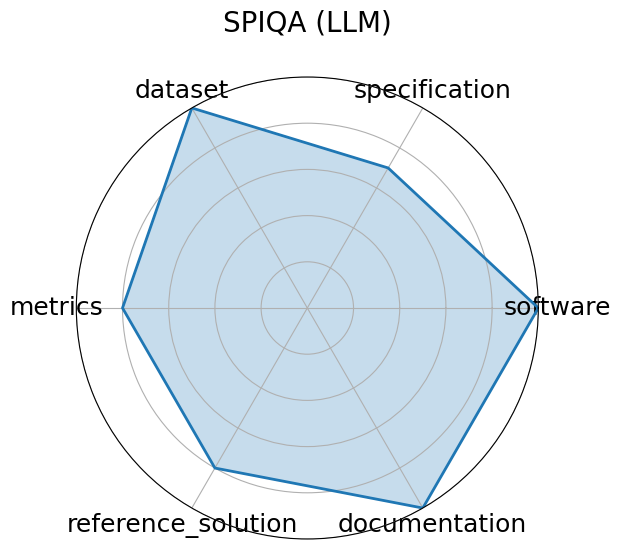

# SPIQA (LLM)

**Date**: 2024-12-13

**Name**: SPIQA  LLM 

**Domain**: Multimodal Scientific QA; Computer Vision

**Focus**: Evaluating LLMs on image-based scientific paper figure QA tasks  LLM Adapter performance 

**Keywords**: multimodal QA, scientific figures, image+text, chain-of-thought prompting

**Task Types**: Multimodal QA

**Metrics**: Accuracy, F1 score

**Models**: LLaVA, MiniGPT‑4, Owl‑LLM adapter variants

**Citation**:

- Shraman Pramanick, Rama Chellappa, and Subhashini Venugopalan. Spiqa: a dataset for multimodal question answering on scientific papers. 2025. URL: https://arxiv.org/abs/2407.09413, arXiv:2407.09413.

  - bibtex: |

      @misc{pramanick2025spiqadatasetmultimodalquestion,

        title={SPIQA: A Dataset for Multimodal Question Answering on Scientific Papers}, 

        author={Shraman Pramanick and Rama Chellappa and Subhashini Venugopalan},

        year={2025},

        eprint={2407.09413},

        archivePrefix={arXiv},

        primaryClass={cs.CL},

        url={https://arxiv.org/abs/2407.09413}, 

      }

**Ratings:**

Specification:

  - **Rating:** 6.0

  - **Reason:** Task of QA over scientific figures is interesting but not fully formalized in input/output terms.

Dataset:

  - **Rating:** 6.0

  - **Reason:** Uses SPIQA dataset with ~10 adapters; figures and questions are included, but not fully open.

Metrics:

  - **Rating:** 7.0

  - **Reason:** Reports accuracy and F1; fair but no visual reasoning-specific metric.

Reference Solution:

  - **Rating:** 6.0

  - **Reason:** 10 LLM adapter baselines; results included.

Documentation:

  - **Rating:** 5.0

  - **Reason:** Poster paper and limited documentation; no reproducibility instructions.

**Radar Plot:**
 