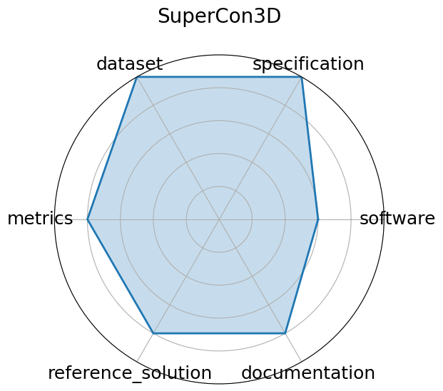

# SuperCon3D

**Date**: 2024-12-13

**Name**: SuperCon3D

**Domain**: Materials Science; Superconductivity

**Focus**: Dataset and models for predicting and generating high‑Tc superconductors using 3D crystal structures

**Keywords**: superconductivity, crystal structures, equivariant GNN, generative models

**Task Types**: Regression  Tc prediction , Generative modeling

**Metrics**: MAE  Tc , Validity of generated structures

**Models**: SODNet, DiffCSP‑SC

**Citation**:

- Pin Chen, Luoxuan Peng, Rui Jiao, Qing Mo, Zhen Wang, Wenbing Huang, Yang Liu, and Yutong Lu. Learning superconductivity from ordered and disordered material structures. In A. Globerson, L. Mackey, D. Belgrave, A. Fan, U. Paquet, J. Tomczak, and C. Zhang, editors, Advances in Neural Information Processing Systems, volume 37, 108902–108928. Curran Associates, Inc., 2024. URL: https://proceedings.neurips.cc/paper_files/paper/2024/file/c4e3b55ed4ac9ba52d7df11f8bddbbf4-Paper-Datasets_and_Benchmarks_Track.pdf.

  - bibtex: |

      @inproceedings{neurips2024_c4e3b55e,

        author = {Chen, Pin and Peng, Luoxuan and Jiao, Rui and Mo, Qing and Wang, Zhen and Huang, Wenbing and Liu, Yang and Lu, Yutong},

        booktitle = {Advances in Neural Information Processing Systems},

        editor = {A. Globerson and L. Mackey and D. Belgrave and A. Fan and U. Paquet and J. Tomczak and C. Zhang},

        pages = {108902--108928},

        publisher = {Curran Associates, Inc.},

        title = {Learning Superconductivity from Ordered and Disordered Material Structures},

        url = {https://proceedings.neurips.cc/paper_files/paper/2024/file/c4e3b55ed4ac9ba52d7df11f8bddbbf4-Paper-Datasets_and_Benchmarks_Track.pdf},

        volume = {37},

        year = {2024}

      }

**Ratings:**

Specification:

  - **Rating:** 10.0

  - **Reason:** Multimodal task  segmentation + natural language QA pairs ;.

Dataset:

  - **Rating:** 10.0

  - **Reason:** sonar imagery + masks + descriptions, georeferenced and labeled with QA

Metrics:

  - **Rating:** 9.0

  - **Reason:** Pixel accuracy and QA metrics clearly defined; tasks split by modality.

Reference Solution:

  - **Rating:** 8.0

  - **Reason:** Baseline models  SegFormer, ViLT  are cited, partial configs likely available.

Documentation:

  - **Rating:** 8.5

  - **Reason:** Paper + GitHub metadata and processing details are comprehensive, though full dataset is not yet available.

**Radar Plot:**
 