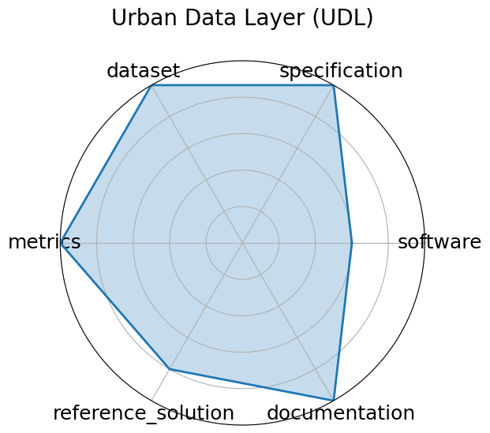

# Urban Data Layer (UDL)

**Date**: 2024-12-13

**Name**: Urban Data Layer  UDL 

**Domain**: Urban Computing; Data Engineering

**Focus**: Unified data pipeline for multi-modal urban science research

**Keywords**: data pipeline, urban science, multi-modal, benchmark

**Task Types**: Prediction, Classification

**Metrics**: Task-specific accuracy or RMSE

**Models**: Baseline regression/classification pipelines

**Citation**:

- Yiheng Wang, Tianyu Wang, Yuying Zhang, Hongji Zhang, Haoyu Zheng, Guanjie Zheng, and Linghe Kong. Urbandatalayer: a unified data pipeline for urban science. In A. Globerson, L. Mackey, D. Belgrave, A. Fan, U. Paquet, J. Tomczak, and C. Zhang, editors, Advances in Neural Information Processing Systems, volume 37, 7296–7310. Curran Associates, Inc., 2024. URL: https://proceedings.neurips.cc/paper_files/paper/2024/file/0db7f135f6991e8cec5e516ecc66bfba-Paper-Datasets_and_Benchmarks_Track.pdf.

  - bibtex: |

      @inproceedings{neurips2024_0db7f135,

        author = {Wang, Yiheng and Wang, Tianyu and Zhang, Yuying and Zhang, Hongji and Zheng, Haoyu and Zheng, Guanjie and Kong, Linghe},

        booktitle = {Advances in Neural Information Processing Systems},

        editor = {A. Globerson and L. Mackey and D. Belgrave and A. Fan and U. Paquet and J. Tomczak and C. Zhang},

        pages = {7296--7310},

        publisher = {Curran Associates, Inc.},

        title = {UrbanDataLayer: A Unified Data Pipeline for Urban Science},

        url = {https://proceedings.neurips.cc/paper_files/paper/2024/file/0db7f135f6991e8cec5e516ecc66bfba-Paper-Datasets_and_Benchmarks_Track.pdf},

        volume = {37},

        year = {2024}

      }

**Ratings:**

Specification:

  - **Rating:** 9.0

  - **Reason:** Three tasks  de novo generation, retrieval, simulation  are clearly defined for MS/MS molecule discovery.

Dataset:

  - **Rating:** 10.0

  - **Reason:** Over 1 million spectra with structure annotations; dataset is open-source and well-documented.

Metrics:

  - **Rating:** 9.0

  - **Reason:** Task-appropriate metrics  structure accuracy, precision, MSE  are specified and used consistently.

Reference Solution:

  - **Rating:** 8.0

  - **Reason:** Baseline models are available  graph-based and retrieval , though not exhaustive.

Documentation:

  - **Rating:** 9.0

  - **Reason:** GitHub repo and poster provide code and reproducibility guidance.

**Radar Plot:**
 