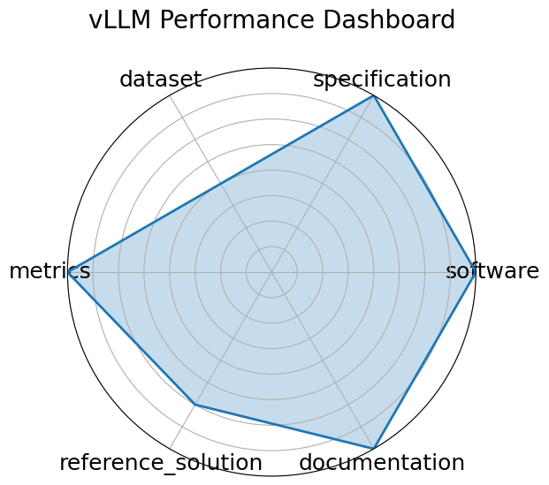

# vLLM Performance Dashboard

**Date**: 2022-06-22

**Name**: vLLM Performance Dashboard

**Domain**: LLM; HPC/inference

**Focus**: Interactive dashboard showing inference performance of vLLM

**Keywords**: Dashboard, Throughput visualization, Latency analysis, Metric tracking

**Task Types**: Performance visualization

**Metrics**: Tokens/sec, TTFT, Memory usage

**Models**: LLaMA-2, Mistral, Qwen

**Citation**:

- Simon Mo. Vllm performance dashboard. 2024. URL: https://simon-mo-workspace.observablehq.cloud/vllm-dashboard-v0/.

  - bibtex: |

      @misc{mo2024vllm_dashboard,

        title={vLLM Performance Dashboard},

        author={Mo, Simon},

        year={2024},

        url={https://simon-mo-workspace.observablehq.cloud/vllm-dashboard-v0/}

      }

**Ratings:**

Specification:

  - **Rating:** 8.0

  - **Reason:** Framed as a model-serving tool rather than a benchmark, but includes benchmark configurations and real model tasks.

Dataset:

  - **Rating:** 6.0

  - **Reason:** Mostly uses dummy configs or external model endpoints for evaluation; not designed around a formal dataset.

Metrics:

  - **Rating:** 8.0

  - **Reason:** Well-defined serving metrics: tokens/sec, time-to-first-token, and gain over baselines.

Reference Solution:

  - **Rating:** 9.0

  - **Reason:** Core framework includes full reproducible serving benchmarks and code; multiple deployment case studies.

Documentation:

  - **Rating:** 9.0

  - **Reason:** High-quality usage guides, examples, and performance tuning docs.

**Radar Plot:**
 